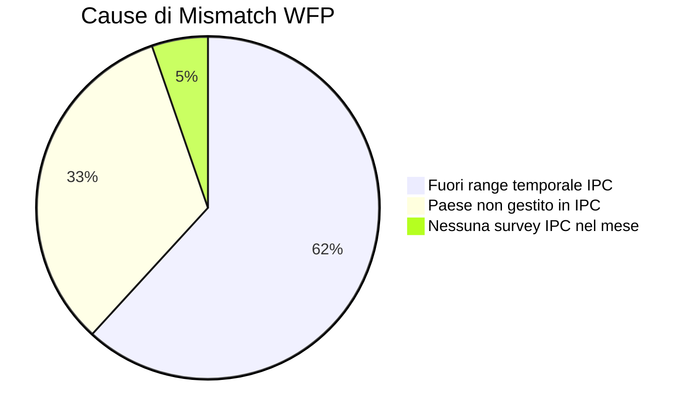
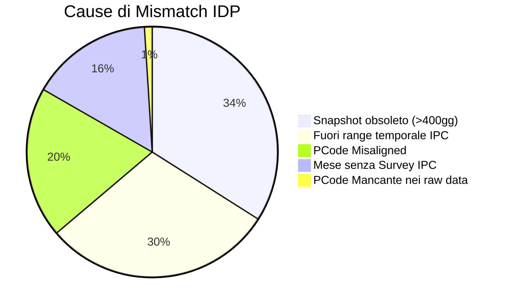

# Analisi dei Casi Scollegati (Mismatch Analysis) - HERO v5

Questo documento fornisce un'analisi dettagliata delle cause per cui i record dei dati raw (WFP, Rainfall, ACLED, IDP) vengono scartati o risultano "scollegati" (lost) durante il processo di fusione (merge) allineato alla "colonna vertebrale" (spine) di **IPC**.

L'analisi evidenzia quanta parte del patrimonio informativo originario vada persa, in quali categorie si dividono le perdite e quali interventi mirati possono ridurle.

---

## 1. Sintesi dei Risultati (Executive Summary)

La tabella seguente riassume i tassi di accoppiamento (match rate) e di perdita (loss rate) per ciascun dataset raw:

| Dataset | Righe Totali | Righe Accoppiate | Righe Scollegate (Lost) | Tasso di Perdita (%) | Causa Principale di Mismatch |
| :--- | :---: | :---: | :---: | :---: | :--- |
| **WFP** (Prezzi) | 757,541 | 179,326 | 578,215 | **76.3%** | Fuori range temporale IPC (61.8%) |
| **Rainfall** (Piogge) | 966,672 | 416,508 | 550,164 | **56.9%** | Fuori range temporale IPC (73.7%) |
| **ACLED** (Conflitti) | 2,435,715 | 525,393 | 1,910,322 | **78.4%** | Fuori range temporale IPC (88.3%) |
| **IDP** (Sfollaati) | 72,281 | 10,305 | 61,976 | **85.7%** | Snapshot obsoleto > 400gg (34.0%) |

> [!IMPORTANT]
> **Il vincolo dell'IPC-Spine**: Il motivo dominante della perdita di dati in quasi tutti i dataset (escluso l'IDP) è di natura **temporale**. Poiché la pipeline utilizza l'IPC come "ancora" (spine), tutti i dati storici raccolti prima dell'inizio delle rilevazioni IPC nel rispettivo paese o nei periodi intermedi privi di survey attive vengono scartati per l'addestramento o l'analisi basata su target IPC.

---

## 2. Analisi Dettagliata per Layer

### 2.1 WFP (World Food Programme - Prezzi dei Prodotti)
Il dataset WFP contiene i prezzi storici di vari prodotti alimentari e di consumo.
* **Tasso di Perdita**: **76.3%** (578,215 righe scartate su 757,541 totali).

#### Ripartizione delle Cause di Mismatch

| Causa | Record Persi | % su Persi | Dettaglio / Spiegazione |
| :--- | :---: | :---: | :--- |
| **Fuori range temporale IPC del paese** | 357,403 | 61.8% | I dati dei prezzi WFP partono spesso dal 2007 (o prima), mentre i record IPC per lo stesso paese iniziano tipicamente dopo il 2016-2017. |
| **Paese non gestito in IPC** | 190,084 | 32.9% | WFP raccoglie dati a livello globale; molti paesi monitorati da WFP non hanno analisi IPC registrate nel dataset HERO. |
| **Mese senza Survey IPC attiva** | 30,728 | 5.3% | L'IPC non è continuo mensilmente; in mesi privi di una survey attiva nel paese, i dati WFP mensili vengono scartati. |

---

### 2.2 Rainfall (Dati Pluviometrici)
* **Tasso di Perdita**: **56.9%** (550,164 righe scartate su 966,672 totali).

#### Ripartizione delle Cause di Mismatch
| Causa | Record Persi | % su Persi | Dettaglio / Spiegazione |
| :--- | :---: | :---: | :--- |
| **Fuori range temporale IPC del paese** | 405,535 | 73.7% | I dati Rainfall coprono serie storiche molto lunghe (spesso dagli anni '80/2000), antecedenti l'era IPC. |
| **Mese senza Survey IPC attiva** | 129,209 | 23.5% | Le piogge sono misurate ogni mese, ma l'assenza di survey IPC intermedie taglia il 23.5% delle righe. |
| **PCode Misaligned** | 8,613 | 1.6% | Lievi incongruenze nei codici geografici (PCode) tra Rainfall e IPC. |
| **Altri Mismatch** | 6,807 | 1.2% | Disallineamenti spaziali complessi (es. aree geografiche non coperte da IPC). |

---

### 2.3 ACLED (Conflitti ed Eventi Violenti)
* **Tasso di Perdita**: **78.4%** (1,910,322 righe scartate su 2,435,715 totali).

#### Ripartizione delle Cause di Mismatch
| Causa | Record Persi | % su Persi | Dettaglio / Spiegazione |
| :--- | :---: | :---: | :--- |
| **Fuori range temporale IPC del paese** | 1,687,482 | 88.3% | ACLED traccia i conflitti storici a partire dal 1997 per molte aree. Quasi 1.7 milioni di eventi sono antecedenti al primo record IPC del rispettivo paese. |
| **Mese senza Survey IPC attiva** | 148,728 | 7.8% | Conflitti avvenuti in mesi di "intervallo" tra le survey IPC. |
| **PCode Misaligned** | 44,115 | 2.3% | Incompatibilità di codifica PCode a livello Admin1 o Admin2 tra ACLED e l'anagrafica IPC. |
| **Altri Mismatch** | 29,997 | 1.6% | Eventi localizzati in aree non mappate politicamente/amministrativamente da IPC. |

---

### 2.4 IDP (Internally Displaced Persons - Sfollaati)
Il dataset IDP mostra il comportamento più atipico ed evidenzia forti criticità di allineamento geografico e temporale.
* **Tasso di Perdita**: **85.7%** (61,976 righe scartate su 72,281 totali).

#### Ripartizione delle Cause di Mismatch

| Causa | Record Persi | % su Persi | Dettaglio / Spiegazione |
| :--- | :---: | :---: | :--- |
| **Snapshot IDP troppo vecchio (>400 giorni)** | 21,082 | **34.0%** | La pipeline esclude gli snapshot IDP più vecchi di 400 giorni rispetto alla fine del periodo IPC per evitare dati obsoleti. Questa soglia taglia più di un terzo dei dati persi. |
| **Fuori range temporale IPC del paese** | 18,476 | 29.8% | Rilevazioni storiche di sfollaati antecedenti all'avvio dell'IPC nel paese. |
| **PCode Misaligned (Geografico)** | 12,115 | **19.5%** | **Fattore critico**: Quasi 1/5 delle righe perse è dovuto a differenze sistematiche nei codici geografici (PCode) tra il dataset IDP e IPC. |
| **Mese senza Survey IPC attiva** | 9,714 | 15.7% | Rilevazioni IDP condotte in periodi privi di survey IPC. |
| **PCode Mancante nei dati raw** | 589 | 1.0% | Record privi di indicazione geografica codificata. |

---

## 3. Considerazioni Chiave e Punti Critici

### A. L'effetto "Filtro Temporale"
Il vincolo di allineare ogni feature a un target IPC (necessario per l'addestramento supervisionato) fa sì che **più del 60-80% dei dati storici delle feature non venga mai integrato nel dataset merged finale**. 
* Questo è fisiologico se l'obiettivo è avere esclusivamente righe complete per addestrare modelli predittivi su target IPC.
* Tuttavia, riduce drasticamente il volume di dati storici utilizzabili per pre-addestramenti self-supervised o analisi di trend di lungo periodo indipendenti da IPC.

### B. Il Problema Geografico dell'IDP (PCode Misalignment)
Mentre per WFP, Rainfall e ACLED il tasso di mismatch geografico (PCode) è trascurabile (1.6% - 2.3%), per il dataset **IDP è del 19.5%** (12,115 record).
* **Cosa significa**: Il dataset IDP utilizza convenzioni o codici PCode a livello Admin1 o Admin2 diversi da quelli registrati nel dataset IPC (ad esempio, codifiche OCHA non aggiornate, spelling differenti o granularità non corrispondenti).
* **Impatto**: Questo porta a una forte sotto-rappresentazione dei dati sugli sfollaati nel dataset finale merged.

### C. La Soglia di Staleness dell'IDP (400 giorni)
Un terzo della perdita di dati IDP (21,082 record) è dovuto alla regola rigida dei 400 giorni.
* Se un paese non ha aggiornamenti sugli sfollaati frequenti, i dati passati vengono del tutto azzerati dopo 400 giorni, lasciando la feature vuota (NaN) nelle righe merged successive, oppure scartando lo snapshot raw.

---

## 4. Raccomandazioni per Migliorare la Pipeline

Se si desidera recuperare parte di questi dati "scollegati", si consiglia di implementare i seguenti miglioramenti:

1. **Riconciliazione dei PCode per IDP (Cross-walk geografico)**:
   * Creare una tabella di traduzione geografica (*cross-walk table*) tra i PCode usati in IDP e quelli standard usati in IPC.
   * Spesso la differenza è dovuta a zero iniziali mancanti (es. `SO-01` vs `SO01`), a codici alternativi o a leggeri disallineamenti di spelling nei nomi delle regioni.
   
2. **Ottimizzazione della Soglia di Staleness dell'IDP**:
   * Valutare se estendere la soglia oltre i 400 giorni per paesi con cicli di rilevamento IDP molto lenti, o implementare un decadimento temporale (*decay function*) del valore stimato anziché un taglio netto.

3. **Esportazione di un Dataset "Unanchored" (Senza Target IPC)**:
   * Creare una modalità della pipeline che salvi un dataset merged alternativo *non ancorato all'IPC*. In questo dataset, i dati di pioggia, conflitti e prezzi verrebbero allineati tra loro a livello puramente spaziale e temporale continuo (es. mensile continuo per tutte le combinazioni Admin1/Admin2 dal 2010 al 2026), indipendentemente dalla presenza di survey IPC. Questo sarebbe utilissimo per modelli di forecasting non supervisionati o autoregressivi.
