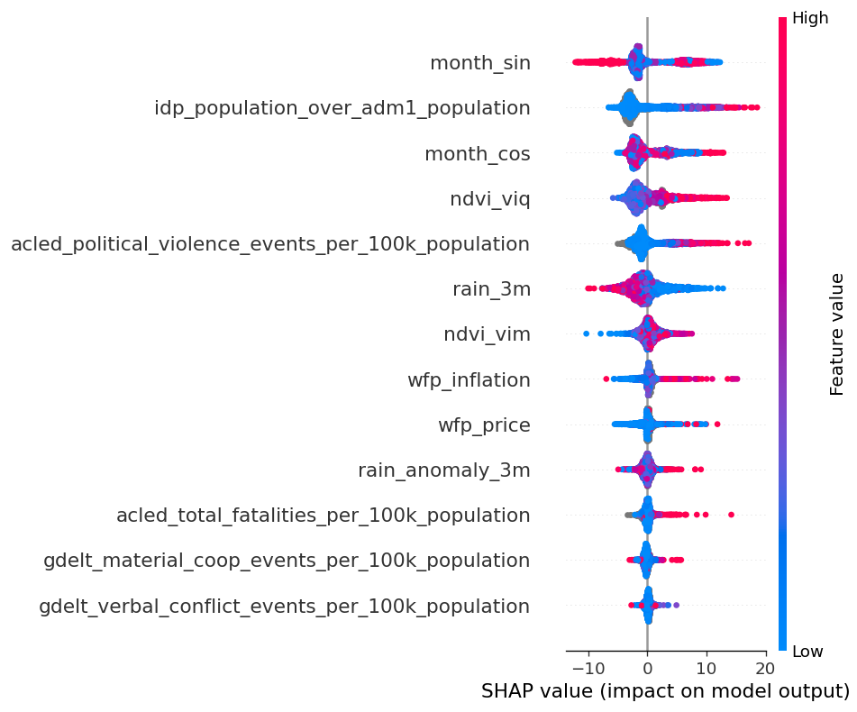
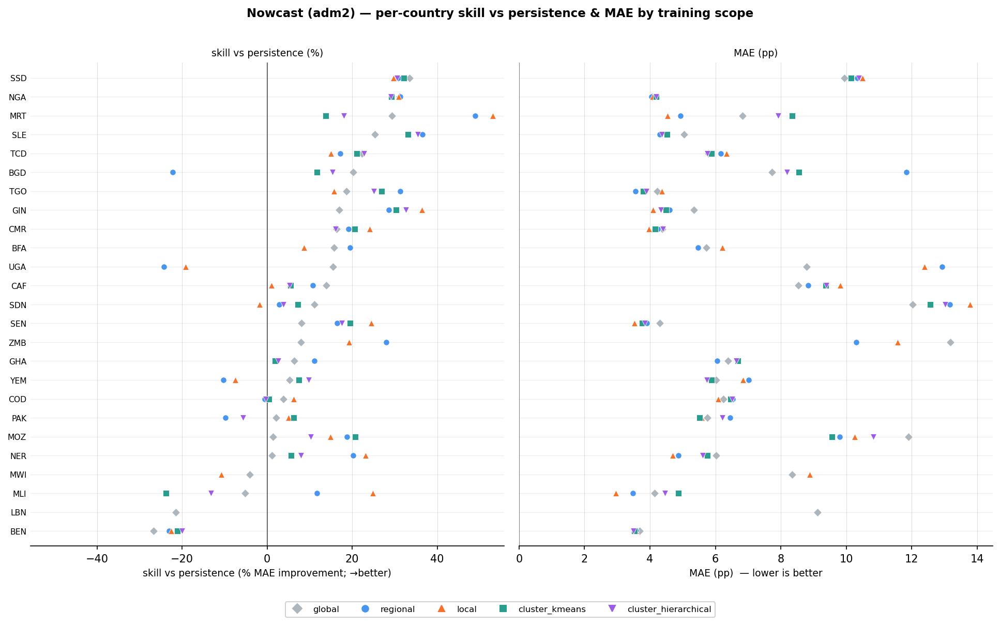

# Admin-2 — Does the Approach Scale?

*The same pipeline, one geographic level finer. Standalone narrative for the admin-2 extension —
**unimputed only** (no imputed adm2 variant exists yet). Read as a delta against the admin-1 findings in
[overview_static_inference.md](overview_static_inference.md) (static) and
[overview_nowcast.md](overview_nowcast.md) (nowcast).*

> **The short version.** Run the identical modelling at admin-2 and the story doesn't just survive — the
> **static "why" model strengthens** (drivers now beat the country baseline, which they couldn't at
> admin-1) and the **nowcast holds** (still +18.5% over persistence). Encouraging for operating at the
> level where decisions are actually made.

---

## 1 · The extension

Nothing about the method changes — only the geographic unit. The level is a switch (`HERO_LEVEL=adm2`);
`AREA_COL` becomes `adm2_pcode` and everything else keys off it unchanged.

- **Rebuilt drivers.** Admin-2 exists only as a raw merge with event *counts*, not the rate drivers. The
  five rate features are reconstructed **in-pipeline** (`prepare_adm2.py`): `raw / population × 1e5` and
  `idp / population`, using a **static per-area proxy** for population — `max(phase_all_number)` per adm2
  unit.
- **Clusters inherited** from the parent adm1 (`CLUSTER_JOIN_COL = adm1_pcode`, joined at load).
- **Unimputed only** — the tree models split on missingness natively; no imputed adm2 dataset exists.

**Scale — roughly 6× the areas:**

| | admin-1 | admin-2 |
|---|---|---|
| areas | 507 | ~3,000+ |
| countries | 37 | 38 |
| static rows (OOF) | 8,457 | 36,938 |
| nowcast current windows | 1,487 | 19,716 |

**Read within-level, not across.** The adm2 denominator is *assessed* population, not total, so adm1 and
adm2 **rates are not directly comparable** — each level's model is internally consistent, and the honest
comparisons below are *within* a level (drivers vs baseline, scope vs global, model vs persistence),
never adm1 pp against adm2 pp.

---

## 2 · Static at admin-2 — the story strengthens

At admin-1 the drivers-only global model *lost* to simply predicting each country's average. **At
admin-2 it wins:**

| model (admin-2, GroupKFold OOF) | R² | MAE (pp) |
|---|---|---|
| **RandomForest** | **0.610** | 8.72 |
| XGBoost | 0.592 | 9.06 |
| LightGBM | 0.585 | 9.20 |
| Country-mean baseline | 0.557 | 9.43 |
| DecisionTree | 0.506 | 9.73 |

The best driver model clears the baseline by a comfortable margin (and the result is robust — both
RandomForest and XGBoost beat it; the models agree). Contrast with admin-1:

| level | baseline R² | best driver model R² | drivers beat baseline? |
|---|---|---|---|
| admin-1 | 0.549 | 0.529 (XGBoost) | **no** |
| admin-2 | 0.557 | **0.610** (RandomForest) | **yes** |

**Why.** Finer geography exposes real *within-country* variation — neighbouring adm2 units inside one
country genuinely differ, and the drivers can explain that difference. At adm1 much of that variation is
averaged away inside the country, so the country prior already captured most of it.

### Localization wins even more broadly

Every scope re-compared to the global model **on exactly the rows it scored**:

| scope | overall R² | MAE (pp) | global on same rows | ΔR² | countries where it beats global |
|---|---|---|---|---|---|
| global | 0.592 | 9.06 | — | — | — |
| **regional** | 0.673 | 7.88 | 0.596 | **+0.077** | 25/27 |
| **local (per-country)** | 0.696 | 7.46 | 0.601 | **+0.095** | **24/24** |
| cluster_kmeans | 0.664 | 8.21 | 0.615 | **+0.049** | 20/23 |
| cluster_hierarchical | 0.673 | 8.08 | 0.615 | **+0.059** | 20/23 |

Two things are stronger than at admin-1: **local beats global in all 24 data-rich countries** (vs 11/11
at adm1, so far wider coverage), and — unlike the *flat* clusters at admin-1 — **the cluster scopes now
add real signal** (+0.05–0.06 ΔR²). The per-country picture, R² (left) and MAE (right), one marker per
scope:

### A note on the drivers (SHAP)

Aggregated SHAP by data source, XGBoost, admin-2:

| driver family | mean \|SHAP\| |
|---|---|
| **seasonality** | 6.20 |
| displacement | 3.73 |
| vegetation | 3.34 |
| conflict | 2.66 |
| rainfall | 2.63 |
| prices | 1.41 |
| media | 0.73 |

The ranking shifts from admin-1, where prices and conflict led: at admin-2 **seasonality dominates**,
with displacement and vegetation next. Treat this cautiously — it is plausibly an artifact of the static
*assessed-population* denominator (a per-area constant that leaves month-of-year as one of the few
things moving within an area) and of finer-grained local seasonal cycles, rather than evidence that
seasonality is suddenly the true primary driver. Displacement and conflict remaining high is the stable,
credible part.

---

## 3 · Nowcast at admin-2 — the story holds

The operational round behaves exactly as it did at admin-1 — strong evidence the mechanism is real and
not an adm1 quirk.

| | admin-1 | admin-2 |
|---|---|---|
| persistence baseline R² | 0.625 | 0.517 |
| headline model R² (`nowcast_change`, XGBoost) | 0.749 | 0.698 |
| **skill vs persistence** | **+17.8%** | **+18.5%** |
| change-direction r | 0.54 | 0.55 |
| countries beating persistence | 17/21 | **22/25** |

*(Raw R²/MAE differ across levels because of the denominator; the level-relative measures — skill %,
change-direction r, and the country win-rate — are what carry over, and they all hold or improve.)*

**Where the skill comes from — same shape as admin-1.** Persistence carries the base; driver levels add
the biggest increment; driver changes add a final nudge (XGBoost R²):

| feature set | R² | adds |
|---|---|---|
| autoregressive (lags only) | 0.614 | last assessment alone beats persistence (0.517) |
| + driver levels | 0.681 | the biggest jump |
| + driver changes | 0.698 | a final nudge |

And the SHAP story is identical: **persistence (lags) ≈ 12.2 dominates, rainfall ≈ 2.8 leads the
exogenous drivers**, then vegetation/displacement/conflict.

**Localization is still a wash.** Every scope lands within ±0.01 R² of the global model on the same rows
(regional +0.001, local −0.005, clusters −0.01) — so, exactly as at admin-1, the recommendation is **one
global model**. The per-country view below plots **skill vs persistence** (% MAE improvement) rather than
R²: for a persistent, low-variance target the within-country R² denominator is tiny, so per-country R²
turns sharply negative even where the nowcast is clearly beating persistence — R² is simply the wrong
lens for this round. Read this way the picture is convincing: for almost every country the markers sit
**right of 0** (all scopes beat persistence), and they sit **on top of each other** (routing to a
regional / local / cluster model adds essentially nothing over global).

*(The R²/MAE version of this chart — `scope_comparison.png`, the same format used in the static section —
still lives in the results folder; the R² panel there is exactly what makes the localized nowcast look
falsely weak, which is why the skill panel above replaces it here.)*

---

## 4 · What it means, and the caveats

**So what.** Taking the same pipeline one level finer *strengthens* the explanatory model (real
within-country variation for the drivers to explain, so they finally beat the country prior) and
*preserves* the operational nowcast (same skill, same mechanism, localization still a wash). Both are
encouraging for a rollout at admin-2 — the level at which targeting and early-warning decisions are
actually taken.

**Caveats (shared across both rounds).**

- **Assessed-population denominator.** Rates use `max(phase_all_number)` per area as a static population
  proxy, so adm1↔adm2 rates aren't directly comparable and any true-population normalization would shift
  levels (not, we expect, the within-level conclusions).
- **Unimputed only** — no imputed adm2 dataset yet (at adm1, imputation helped the nowcast most).
- **Sparse drivers** — WFP prices (~29%) and IDP displacement (~39%) are thin at adm2.
- **~23% of areas lack a cluster** (parent adm1 absent from the cluster table).
- **Region-map gaps** — a few adm2-only countries (e.g. DOM, LBN, PSE, MWI) fall outside the 6-region
  map, so they have no regional scope.

**Next step.** A properly normalized + imputed + clustered admin-2 dataset would remove the denominator
caveat and let the nowcast benefit from imputation as it does at admin-1; extending the region map would
close the coverage gaps.

---

*Reference: pipeline mechanics in [methodology.md](methodology.md) (§9 covers the level switch);
complete results record in [overview.md](overview.md). Companion narratives:
[overview_static_inference.md](overview_static_inference.md) and [overview_nowcast.md](overview_nowcast.md).*
