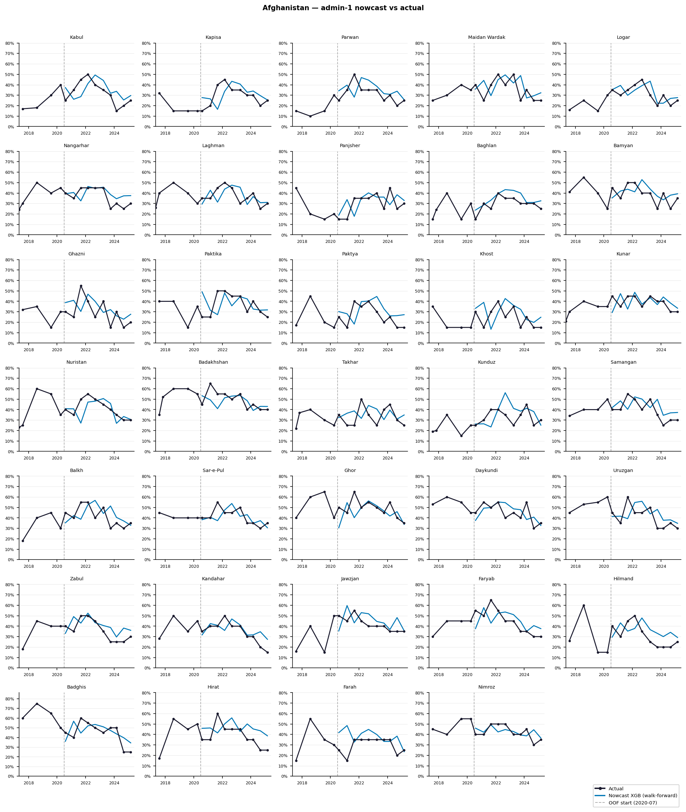
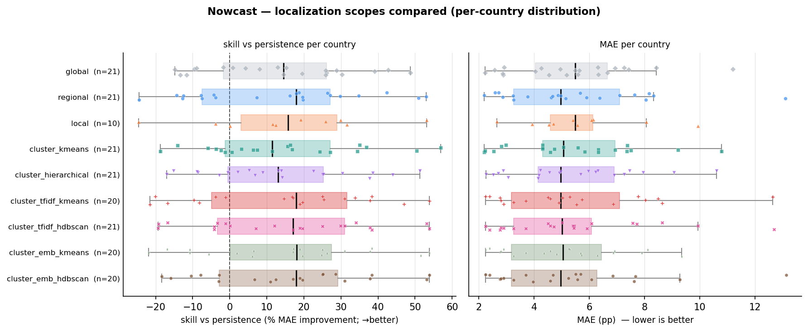

# Nowcasting — Results Walkthrough

*Tracking IPC food-insecurity crisis levels between assessments from drivers: what we did, how well it
works, and why. Standalone narrative for the nowcast ("is this area deteriorating right now?") round —
**imputed dataset only**, admin-1.*

---

## 1 · The approach

**Question.** IPC assessments are expensive and infrequent. Between two field rounds, can we estimate an
area's **current** IPC Phase 3+ (`phase_3plus_percentage`) from its **last known assessment** plus the
**latest drivers**? This is the *operational / early-warning* use case — tracking change over time,
as opposed to explaining cross-sectional differences.

**Panel.** One row per (area, window). When IPC re-classifies a window across successive analyses we keep
the authoritative reading (current > first projection > second projection). Evaluation is on **observed
current windows** — the real, non-projected assessments.

**Features — last assessment + drivers + their changes.** Three nested feature sets let us decompose
*where the skill comes from*:

- `autoregressive` — the last assessments only: `lag1`, `lag2`, `recent_trend = lag1 − lag2`.
- `nowcast` — autoregressive **+ the 11 driver levels** (conflict, displacement, rainfall, vegetation,
  prices, media) + seasonality.
- `nowcast_change` — nowcast **+ each driver's change since the area's previous window** (`change_<driver>`)
  — because nowcasting is fundamentally about *change*.

**Baseline — persistence.** Carry the last known IPC forward. IPC is persistent, so this is a *strong*
baseline; the honest measure of value is **skill = MAE improvement over persistence**, not raw R².

**Validation — walk-forward, never using the future.** A **rolling-origin expanding backtest**. For each
of 5 origins (**2023-07 … 2025-07**), the model trains on **all windows strictly before the origin** and
is tested on the **next 6 months**; the origin then advances and the training window grows. Predictions
are pooled across the five test slices and scored on the observed current windows (**1,487 area-months
across 31 countries**). Because training always precedes the test window in time, no future information
ever leaks backward — the opposite failure mode from a random split.

---

## 2 · High-level results

Pooled walk-forward backtest, imputed dataset, scored on observed current windows (XGBoost headline):

| feature set | model | R² | MAE (pp) | skill vs persistence |
|---|---|---|---|---|
| **nowcast_change** | **XGBoost** | **0.749** | **5.08** | **+17.8%** |
| nowcast | LightGBM | 0.745 | 5.13 | +17.0% |
| nowcast_change | RandomForest | 0.745 | 5.17 | +16.5% |
| autoregressive (lags only) | XGBoost | 0.683 | 5.88 | +4.9% |
| **— (persistence baseline)** | — | 0.625 | 6.19 | 0.0% |
| drivers_only (no lags) | XGBoost | 0.503 | 7.66 | −23.9% |

- **Drivers + the last assessment beat naive carry-forward by +17.8% MAE** (5.08 vs 6.19 pp), lifting R²
  from 0.625 to **0.749**.
- **This holds country by country: the model beats persistence in 17 of 21 countries.**
- **The model tracks real change**, not just level: change-direction correlation (predicted vs actual
  change since the last assessment) is **r = 0.54**.

This is the deployable capability — flag deterioration in the months between IPC rounds.

### Where the skill comes from

Decomposing the headline model by feature set (XGBoost R²):

| feature set | R² | what it adds |
|---|---|---|
| autoregressive (lags only) | 0.683 | the last assessment alone already beats persistence (0.625) |
| + driver **levels** (nowcast) | 0.742 | the biggest single jump — drivers add on top of persistence |
| + driver **changes** (nowcast_change) | 0.749 | a final nudge from *how fast* drivers are moving |

Two things stand out. First, **most of the signal is persistence** — the last known IPC carries the
base, and a `drivers_only` model with no lags scores just 0.503, *below* the persistence baseline.
Second, the value the model adds over persistence comes from **exogenous drivers**, and the strongest of
those is the **change in rainfall** — the leading early signal that conditions are shifting.

---

## 3 · A real case — Afghanistan

The walk-forward nowcast (line) tracked against the actual observed IPC (points) for Afghanistan's
admin-1 areas:

The nowcast follows the real trajectory — including turns — rather than simply flat-lining the last
value, which is exactly what a useful early-warning signal must do.

---

## 4 · Localization — here it's a wash

As in the static round, we re-run the nowcast at **nine training scopes** — **global**, **regional**,
**local** (per-country), two **driver-fingerprint** clusters, and **four text-narrative** clusters (a
TF-IDF and a dense-embedding representation of the IPC report text, each split by K-Means and HDBSCAN,
collapsed to one static per-country label). Each row is routed to its own subgroup's model; each scope is
re-compared to the global model **on exactly the rows it scored**:

| scope | overall R² | MAE (pp) | global on same rows (R²) | ΔR² |
|---|---|---|---|---|
| **global** | **0.742** | **5.23** | — | — |
| regional | 0.734 | 5.26 | 0.742 | −0.008 |
| local (per-country) | 0.649 | 5.37 | 0.638 | +0.012 |
| cluster_kmeans (drivers) | 0.751 | 5.16 | 0.744 | +0.007 |
| cluster_hierarchical (drivers) | 0.754 | 5.16 | 0.744 | +0.010 |
| cluster_tfidf_kmeans (text) | 0.660 | 5.56 | 0.725 | −0.065 |
| cluster_tfidf_hdbscan (text) | 0.744 | 5.19 | 0.745 | −0.001 |
| cluster_emb_kmeans (text) | 0.763 | 4.91 | 0.759 | +0.004 |
| cluster_emb_hdbscan (text) | 0.746 | 5.18 | 0.752 | −0.006 |

**Localization barely moves the needle for the nowcast — every scope sits essentially on top of the
global model on the same rows** (all within ±0.01 R² except `cluster_tfidf_kmeans` at −0.065, which is
*worse*). Strikingly, the **text-narrative clusters that lifted the static model by +0.11–0.13 add nothing
here.** This is the opposite of the static round, and it makes sense: once you condition on an area's
*own last assessment*, the "which crisis context is this" information that localization supplies —
geographic, behavioural, or narrative — is largely already baked in. **The recommendation is one global
model.**

The per-country picture confirms it — no scope consistently wins (regional beats global in 8/21, local
5/10, the driver clusters 9–11/21, and the text clusters 6–10 of ~20; the best scope differs country to
country). The compact box-per-scope summary — here the honest lens is **skill vs persistence** (per-country
R² is savage for a persistent target), dashed line = ties persistence:

And the full per-country detail:

Read **both panels together**: R² is variance-explained *within* a country, so a stable, low-crisis
country can post a negative R² even where its MAE (right panel) is small and the model is genuinely fine
— R² is just the wrong lens there.

---

## 5 · What drives the nowcast

Aggregated SHAP (mean |SHAP|) for the headline `nowcast_change` XGBoost model, imputed data:

| feature family | mean \|SHAP\| |
|---|---|
| **persistence (lags)** | 11.68 |
| **rainfall** | 2.26 |
| conflict | 1.41 |
| prices | 1.36 |
| vegetation | 1.19 |
| seasonality | 0.97 |
| displacement | 0.76 |
| media | 0.76 |

- **Persistence dominates** — the last assessment (≈11.7) outweighs every driver several times over. The
  nowcast is, first and foremost, anchored to where the area already was.
- **Rainfall is the strongest exogenous signal** (≈2.3) — the leading indicator among the drivers,
  consistent with rainfall *change* being what lifts R² over the lags-only model.
- Conflict, prices and vegetation form the next tier; media and displacement contribute least here.

The picture is coherent with the skill decomposition: persistence is the foundation, and the model earns
its +17.8% by reading the drivers — rainfall first — on top of it.

**Does it scale?** Run the identical nowcast one geographic level finer and it **holds** — +18.5% skill
over persistence, beating it in 22/25 countries, with the same skill decomposition and localization-wash.
See [overview_admin2.md](overview_admin2.md).

---

*Reference: full pipeline mechanics in [methodology.md](methodology.md); complete results record
(both datasets, all rounds, admin-2) in [overview.md](overview.md). Companion narrative for the other
round: [overview_static_inference.md](overview_static_inference.md).*
