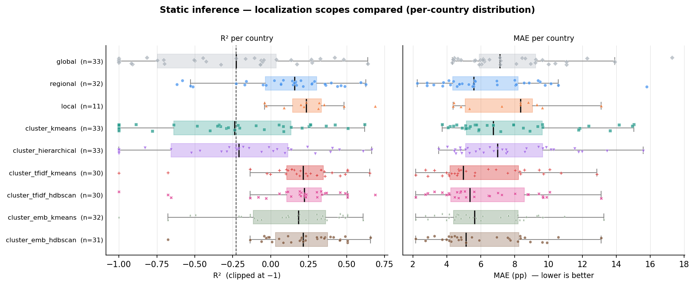

# Static Inference — Results Walkthrough

*Explaining IPC food-insecurity crisis levels from drivers: what we did, how well it works,
and why. Standalone narrative for the static ("why is this area worse than that one?") round —
**imputed dataset only**, admin-1.*

---

## 1 · The approach

**Question.** For a given area-month, can routinely-available *drivers* explain the share of the
population in **IPC Phase 3+** ("Crisis or worse", `phase_3plus_percentage`, a 0–100 scale)? This is
the *explanatory / targeting* use case — cross-sectional, "why is one place worse than another",
as opposed to tracking change over time.

**Inputs — drivers only, no geography.** 13 model features: 11 driver rates across six families
(conflict, displacement, rainfall, vegetation, food prices, media) plus cyclical seasonality
(`month_sin`, `month_cos`). We deliberately **exclude country identity and coordinates** — otherwise a
model just memorizes *which* place it is looking at instead of learning the driver→IPC relationship,
and gains no honest out-of-sample accuracy.

**Scale.** 8,457 area-months · 507 admin-1 areas · 37 countries.

**Validation — leakage-safe by construction.** `GroupKFold(5)` grouped **by area**, out-of-fold. IPC
is spatially and temporally autocorrelated and each area recurs across many windows, so a random row
split would leak an area's typical level into the test set. Holding out **whole areas** means every
scored area is genuinely unseen. Four tree models are compared (XGBoost is the headline); the
**baseline is the per-country mean** — "can drivers beat simply predicting each country's average
level?"

---

## 2 · The overall numbers

Out-of-fold leaderboard, imputed dataset:

| model | R² | MAE (pp) | RMSE (pp) |
|---|---|---|---|
| **Country-mean baseline** | **0.549** | **8.55** | 11.37 |
| XGBoost (drivers) | 0.529 | 8.77 | 11.62 |
| LightGBM | 0.519 | 8.90 | 11.75 |
| RandomForest | 0.486 | 9.11 | 12.14 |
| DecisionTree | 0.299 | 10.56 | 14.18 |

The models agree, XGBoost leads them — **and the drivers-only global model does not beat the
country-mean baseline** (R² 0.529 vs 0.549; MAE 8.77 vs 8.55 pp).

---

## 3 · Why we don't do well globally

This is an *insight*, not a failure of the drivers.

- **Knowing the country already captures most of the cross-sectional variance.** A large part of "why
  is this area worse" is simply *which country* it is in — chronic structural differences between,
  say, South Sudan and Guatemala. The country-mean baseline gets that for free.
- **One global driver→IPC mapping is asked to generalize across 37 very different contexts.** The same
  rainfall anomaly, the same conflict rate, the same displacement level mean different things in the
  Sahel, the Horn, Central America, and Yemen. Forcing a single function to fit them all averages away
  exactly the relationships that matter locally.

So the global model isn't the product. It tells us **where the value is: *within* countries and
regions, not in one global "why" model.** That points straight at localization.

---

## 4 · Localization works — and text-narrative clusters help most

We re-run the round at **nine training scopes**: **global**, **regional** (6-region agro-climatic map),
**local** (one model per country), two **driver-fingerprint** cluster schemes (`cluster_kmeans`,
`cluster_hierarchical`, the colleague's feature-based clustering of each area's driver time-series), and
**four text-narrative** cluster schemes built from the IPC *report text* — a TF-IDF and a
dense-embedding representation, each split by K-Means and HDBSCAN (`cluster_tfidf_kmeans/hdbscan`,
`cluster_emb_kmeans/hdbscan`). The text clusters are collapsed to one **static per-country** label (each
country's dominant narrative type) and joined by country; the 14 (mostly West-Africa/Sahel) countries
absent from the text corpus share one catch-all group, so every text scope still covers all rows (the
full cluster→country membership is in [cluster_membership.md](cluster_membership.md)). Every row is
routed to its subgroup's model; results are always reported per country, and local/cluster models are
only built where a full model is defensible (≥300 rows).

Pooled metrics per scope, each re-compared to the global model **on exactly the rows it scored**
(apples-to-apples "did routing help?"):

| scope | overall R² | MAE (pp) | global on same rows (R²) | ΔR² |
|---|---|---|---|---|
| global | 0.529 | 8.77 | — | — |
| regional | 0.617 | 7.64 | 0.529 | +0.088 |
| **local (per-country)** | 0.589 | 7.91 | 0.445 | **+0.144** |
| cluster_kmeans (drivers) | 0.527 | 8.66 | 0.529 | −0.002 |
| cluster_hierarchical (drivers) | 0.538 | 8.51 | 0.529 | +0.009 |
| **cluster_tfidf_kmeans** (text) | **0.658** | **7.17** | 0.531 | **+0.127** |
| **cluster_tfidf_hdbscan** (text) | 0.657 | 7.31 | 0.533 | +0.124 |
| **cluster_emb_kmeans** (text) | 0.646 | 7.36 | 0.532 | +0.114 |
| **cluster_emb_hdbscan** (text) | 0.657 | 7.30 | 0.531 | +0.126 |

- **Regional and local behave as before.** Regional lifts pooled R² 0.529 → 0.617 and cuts MAE by more
  than a point (8.77 → 7.64 pp) with near-complete coverage (35 of 37 countries); **local wins hardest**
  on the 11 data-rich countries, beating global **in all 11** (ΔR² **+0.144**). The gains are largest on
  the harder, higher-variance countries — TCD, NGA, SOM, SSD, GTM, HND all flip from negative to positive
  R² under a local or regional model.
- **The driver-fingerprint clusters are flat** (ΔR² ±0.01). Those groups aren't a better partition than
  the geography we already have here.
- **The text-narrative clusters are the strongest cluster scopes — and even edge out the geographic
  region map.** All four add **+0.11 to +0.13 ΔR²** and cut MAE by ~1.4–1.6 pp, beating global in **27–29
  of ~30** scored countries. Grouping countries by *what their IPC reports are about* turns out to be a
  better partition than grouping them by agro-climatic region.
- **Why it works — and the honest caveats.** The embedding K-Means groups are interpretable crisis
  typologies: **conflict-refugee** (AFG, COD, SSD, YEM), **agropastoral-water** (KEN, SDN, TLS, ZWE),
  **agricultural-price-inflation** (a Latin-America-plus block: AGO, BGD, CAF, ECU, GTM, HND, HTI, SLV),
  **child-malnutrition** (MOZ, PAK, SOM), **COVID-economic** (ETH, ZAF). Grouping like-with-like context
  lets the drivers fit relationships that a single global mapping averages away. Two caveats: (i) the
  text clusters operate at **country granularity** (each country sits wholly in one group), so — like
  regional and local — part of their gain is simply "grouping countries helps," not a sub-country signal;
  and (ii) each scope is a **hybrid** — the 14 text-less countries are pooled into one catch-all "rest"
  bucket that reflects *absence of text*, not a narrative type.

The clean at-a-glance comparison — each scope's per-country R² and MAE as a box (median, IQR, whiskers);
the dashed line marks the global median R², so a box sitting to its right typically beats global:

The full per-country detail — one marker per country per scope, R² (left) and MAE (right), best country
at the top:

Read **both panels together**: R² is variance-explained *within* a country, so a stable, low-crisis
country (SEN, BEN, GHA) can post a large-negative R² while its MAE is only 3–6 pp — the model is
actually fine there, R² is just the wrong lens. What the charts show cleanly is that for almost every
country the coloured **regional / local / text-cluster** markers sit to the right (higher R²) and to the
left (lower MAE) of the grey **global** marker.

---

## 5 · What drives food insecurity

Finally, the global model's explanation. Aggregated SHAP (mean |SHAP|) for XGBoost on the imputed
data, by data source:

| driver family | mean \|SHAP\| |
|---|---|
| **food prices** | 4.04 |
| **conflict** | 3.88 |
| seasonality | 3.38 |
| vegetation | 2.87 |
| **displacement** | 2.56 |
| media | 2.15 |
| rainfall | 1.76 |

- **Food prices and conflict dominate the explanation** — the two strongest levers on how much of a
  population is in crisis, which matches the field intuition (price shocks and violence drive acute
  food insecurity).
- **Displacement, vegetation and rainfall add real context** but sit a tier below; media is the
  weakest single family.
- The hierarchy is **stable and interpretable** — a direct benefit of the drivers-only, no-geography
  design: because the model can't lean on "which country", every bit of signal it uses is an actual
  driver relationship we can read off.

**Does it scale?** Run the identical static round one geographic level finer and it **strengthens** — at
admin-2 the drivers *beat* the country-mean baseline (which they can't here), and localization wins even
more broadly. See [overview_admin2.md](overview_admin2.md).

---

*Reference: full pipeline mechanics in [methodology.md](methodology.md); complete results record
(both datasets, all rounds, admin-2) in [overview.md](overview.md). Companion narrative for the other
round: [overview_nowcast.md](overview_nowcast.md).*
