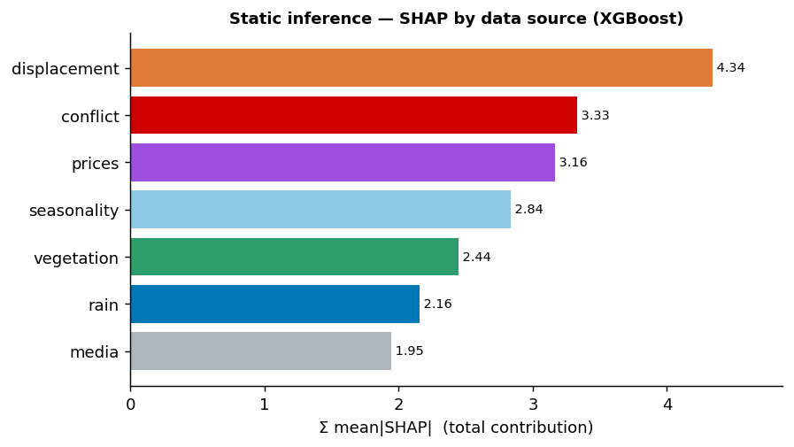

# Predicting IPC Food-Insecurity Crisis from Drivers
### HERO v6 — project review deck

> **Thesis.** Routinely-available **drivers can nowcast IPC crisis levels between expensive field
> assessments** — beating the naive carry-forward in 17 of 21 countries. The static "why" model becomes
> useful only once **localized** per-country; the approach **sharpens at finer geography (admin-2)**; and
> the evaluation is **hardened** (leakage-safe, honest metrics, a real data bug fixed) so the numbers hold.

*This deck is the presentation layer; [overview.md](overview.md) is the full reference record and
[methodology.md](methodology.md) the how/why. One message + one chart per slide; details in the Appendix.*

---

## 1 · Why this matters

- **IPC Phase 3+** (share of a population in "Crisis or worse") is the authoritative food-insecurity
  signal — but assessments are **expensive, infrequent, and patchy** in space and time.
- **Question:** can we predict and track it from *routinely-available drivers* — conflict, displacement,
  rainfall, food prices, vegetation, media — to fill the gaps between assessments?
- **Two complementary questions, two rounds:**
  - **Static** — *why is one area worse than another?* (explanatory / targeting)
  - **Nowcast** — *is this area deteriorating right now?* (operational / early-warning)

*Speaker note: these two use cases have different "winners" later — that's intentional, not a contradiction.*

---

## 2 · Data & approach

- **Drivers only — no country identity, no coordinates** (by design: force the model to learn
  driver→IPC relationships, not memorize *which* place it is).
- **11 rate features** (2 conflict, displacement, 2 rainfall, 2 vegetation, 2 prices, 2 media) + seasonality.
- **Scale:** 8,457 area-months · 507 admin-1 areas · 37 countries  →  **3,000+ areas at admin-2**.
- Four tree models compared; **XGBoost** is the headline. Two rounds (static, nowcast) × localization.

*Speaker note: deliberately simple and driver-based — the goal is an honest, interpretable complement to
IPC, not a black box.*

---

## 3 · Trustworthy by construction

*Why you can believe the numbers that follow.*

- **Leakage-safe validation.** Static: hold out **whole areas** (GroupKFold by area) — a scored area is
  genuinely unseen. Nowcast: **walk-forward** backtest — never use the future to predict the past.
- **Honest metrics.** We don't lead with R² alone — it misleads for stable, low-crisis countries. We
  report **MAE (percentage points)** and **skill vs a naive baseline**, which stay meaningful everywhere.
- **We found and fixed a real data bug.** 28 "phantom" rows (`phase_all_number = 0` → no analysis, so a
  spurious 0% crisis) were poisoning the time-series and manufacturing fake ±50pp swings. Removing them
  **raised nowcast R² by ~0.10.**

*Speaker note: this slide earns the audience's trust up front; keep it crisp.*

---

## 4 · Headline result — nowcasting works

**The operational payoff: drivers + last assessment beat the naive "carry the last value forward" in
17 of 21 countries.**

- Best R² ≈ **0.75**; **+14–18%** MAE improvement over persistence; change-direction r ≈ 0.53.
- Green = model beats persistence (most countries, some by 20–35%); red = the few it doesn't.

*Speaker note: this is the deployable capability — flag deterioration in the months between IPC rounds.
Aside to reuse: negative-R² countries here (MRT, SOM) still beat persistence — R² misleads, skill doesn't.*

---

## 5 · Nowcast — where the skill comes from

**Most of the signal is the last known IPC (persistence); the strongest *new* signal is the change in
rainfall. The model tracks real deteriorations.**

| feature set | R² |
|---|---|
| last-assessment lags only | 0.68 |
| + driver levels | 0.74 |
| + driver *changes* | **0.75** |

*Speaker note: exogenous drivers add on top of persistence; rainfall-change leads. Imputation helps the
nowcast (denser lags/changes).*

---

## 6 · Static — drivers explain, but you must localize (1/2)

**Globally, drivers-only barely matches "just predict the country's average" (R² 0.53 vs 0.55).**

| model (admin-1) | R² | MAE (pp) |
|---|---|---|
| Country-mean baseline | **0.549** | 8.55 |
| XGBoost (drivers) | 0.530 | 8.77 |

- Knowing *which country* a row is in already captures most of the cross-sectional variance.
- **This is an insight, not a failure** — it tells us where the value is: *within* countries, not in one
  global "why" model. (Next slide.)

*Speaker note: don't apologize for this number — it motivates localization.*

---

## 7 · Static — localization is the fix (2/2)

**Per-country and regional models beat the global model in 11/11 data-rich countries.**

| scope | overall R² | vs global (same rows) | ΔR² |
|---|---|---|---|
| global | 0.529 | — | — |
| **regional** | 0.617 | 0.529 | **+0.09** |
| **local (per-country)** | 0.589 | 0.445 | **+0.14** |
| clusters (2 schemes) | ~0.53 | 0.529 | ±0.01 (flat) |

*Speaker note: local wins hardest exactly on the harder, higher-variance countries. Clusters (colleague's
unsupervised driver-fingerprint groups) don't help at adm1 — see Appendix.*

---

## 8 · What drives food insecurity

**Conflict, displacement, and food prices dominate the explanation; rainfall and vegetation add context.**

- Aggregated SHAP by data source (XGBoost). The hierarchy is stable and interpretable — a direct benefit
  of the drivers-only, no-geography design.

*Speaker note: displacement leads on raw data; prices rise once missing values are imputed — the ranking
is robust, the exact order shifts a little with imputation.*

---

## 9 · It scales to admin-2

**Same pipeline at 3,000+ areas — and the story gets *stronger*.**

- **Static drivers now beat the country baseline** (R² 0.61 vs 0.56) — finer geography exposes real
  *within-country* variation for the drivers to explain.
- **Localization wins even more broadly:** local beats global in **24/24** data-rich countries; clusters
  now help a little too.
- **Nowcast still beats persistence** (+18.5%, 22/25 countries).

*Speaker note: the approach generalizes down a level and sharpens — encouraging for operational rollout.*

---

## 10 · Recommendations — how to deploy

| Use case | Recommendation |
|---|---|
| **Nowcast** (early-warning) | **One global model**, run between assessments; **impute**. The operational product. |
| **Static** (explain / target) | **Per-country / regional** models — not one global model. |
| **Clusters** | Not worth the added machinery yet (flat at adm1, mild at adm2). |
| **Data quality — flag to owners** | **YEM**: intrinsically volatile → high static error. **MRT**: conflict + displacement data **missing at source** (0/225 rows). |

*Speaker note: the two products have different winners (global nowcast vs local static) — say so plainly.*

---

## 11 · Caveats & next steps

- **Honest limits:** drivers-only static is fundamentally hard; admin-2 uses an *assessed*-population
  denominator (not a true total); no hyperparameter tuning; cluster scopes add little.
- **Next steps:**
  - a properly normalized + imputed + clustered **admin-2 dataset** (removes the denominator caveat);
  - extend the region map to the few unmapped admin-2 countries;
  - light hyperparameter tuning;
  - an **operational pilot** of the nowcast between real IPC rounds.

*Speaker note: close by repeating the thesis — nowcast works and is deployable; static guides targeting
once localized; it scales; and the evaluation is trustworthy.*

---

## Appendix

*Reference material — not presented; for Q&A.*

### A1 · Imputed vs unimputed — the verdict
**Impute for nowcast; neutral for static.** Nowcast is best on imputed (0.749 vs 0.740 R²) because its
lag/change features get denser; static is a tie (unimputed 0.530 vs imputed 0.529). One data round;
directional vs earlier rounds.

### A2 · Full leaderboards (GroupKFold OOF, static)
| Model | unimputed R² | unimputed MAE | imputed R² | imputed MAE |
|---|---|---|---|---|
| Country-mean baseline | 0.549 | 8.55 | 0.549 | 8.55 |
| XGBoost | 0.530 | 8.89 | 0.529 | 8.77 |
| LightGBM | 0.521 | 8.99 | 0.519 | 8.90 |
| RandomForest | 0.505 | 9.06 | 0.486 | 9.11 |
| DecisionTree | 0.346 | 10.29 | 0.299 | 10.56 |

Nowcast best R²: unimputed 0.740 / imputed 0.749; persistence baseline 0.625; skill +14.3% / +17.8%.

### A3 · SHAP by data source (full)
Static (mean|SHAP|): unimputed — displacement 4.34, conflict 3.33, prices 3.16, seasonality 2.84,
vegetation 2.44, rain 2.16, media 1.95; imputed — prices 4.04, conflict 3.88, seasonality 3.38,
vegetation 2.87, displacement 2.56, media 2.15, rain 1.76.
Nowcast: persistence (lags) ~11.6 dominates; rain ~2.3 leads exogenous; then conflict/prices/vegetation.

### A4 · The phantom-row fix (detail)
Rows with `phase_all_number ≤ 0` = no IPC analysis for that area-window, so `phase_3plus_percentage = 0`
is spurious. Left in, they entered training and (worse) became lag values, manufacturing fake ±50pp
window-to-window swings (concentrated in Yemen). Dropped on load (`features.load_dataset`): 28 rows,
8,457 remain; nowcast R² rose ~0.10 and Yemen's apparent volatility fell from ~16.6 to ~9.5 pp/window.

### A5 · R² vs MAE per country (why we use both)
Per-country R² is variance-explained *within* a country → stable low-crisis countries (SEN, BEN, GHA)
show large-negative R² despite 4–6pp MAE. Pooled headline R² is partly cross-sectional (ranking high-
vs low-crisis countries). Honest within-country signals: per-country **MAE**, nowcast
**skill-vs-persistence**, and **change-direction r**.

### A6 · Localization mechanics & clusters
Five scopes: global / regional (6-region map) / local (per-country) / two cluster schemes
(`cluster_kmeans`, `cluster_hierarchical` — the colleague's unsupervised, feature-based clustering of
each area's driver time-series, joined from the parent adm1). Local/cluster models built only where a
full XGBoost is defensible (≥300 rows); per-country metrics reported above a scored-row floor (static 40,
nowcast 30). Nowcast localization is a **wash** at both levels (|ΔR²| ≤ 0.01) → keep one global model.

### A7 · Admin-2 specifics & caveats
adm2 exists only as raw counts → the 5 rate drivers are rebuilt in-pipeline (`prepare_adm2.py`,
`raw / max(phase_all_number) × 1e5`, a static per-area *assessed*-population proxy); clusters inherited
from the parent adm1; **unimputed only**. Caveats: assessed (not total) population denominator → adm1↔adm2
rates not directly comparable; WFP (29%) and IDP (39%) sparse; ~23% of areas lack a cluster; a few
adm2-only countries (DOM/LBN/PSE/MWI/…) fall outside the region map. Run: `python run_all.py adm2`.
