# HERO v6 — Modelling Overview

**Target:** `phase_3plus_percentage` — share of population in IPC Phase 3+ ("Crisis or worse")
at admin-1 level across 52 countries.

**Dataset:** `merged_adm1_wide.parquet` — 10,024 rows × 62 columns (9,869 with a non-null
target). All models handle NaN natively (no imputation round yet). The driver set has
**33 features**.

**Three modelling rounds:**
1. **Static inference** — predict IPC from instantaneous drivers, no time structure; validated by geographic hold-out.
2. **Nowcasting** — predict an area's *current* IPC from its last assessment plus latest drivers; validated by rolling-origin backtest.
3. **Localization** — test whether **localizing** the model (regional / per-country) beats one global model.

> For the full technical pipeline (data, features, validation, models) and a limitations list, see [methodology.md](methodology.md).

---

## Round 1 — Static Inference

*Predict IPC from instantaneous drivers alone, no time structure.*

**Features (33):** 8 ACLED conflict metrics (per-100k pop), IDP rate, 5 rainfall metrics,
2 NDVI vegetation-health metrics, WFP food price + inflation, 12 GDELT media signals,
Country (ordinal), year, month.

**Validation:** geographic hold-out (entire areas withheld) via GroupShuffleSplit +
GroupKFold (5-fold). Random split run in parallel for comparison.

### Geographic hold-out (primary)

| Model | MAE (pp) | RMSE (pp) | R² |
|---|---|---|---|
| **RandomForest** | **7.48** | **10.80** | **0.597** |
| XGBoost | 7.49 | 10.87 | 0.592 |
| LightGBM | 7.60 | 11.04 | 0.579 |
| Baseline (country mean) | 8.36 | 11.65 | 0.531 |
| DecisionTree | 8.59 | 12.28 | 0.479 |

### Random hold-out (for comparison)

| Model | MAE (pp) | RMSE (pp) | R² |
|---|---|---|---|
| XGBoost | 6.46 | 8.86 | 0.726 |
| RandomForest | 6.58 | 9.06 | 0.713 |
| LightGBM | 6.71 | 9.14 | 0.708 |

The ~0.12–0.13 R² gap between random and geographic is **spatial autocorrelation inflation** —
test rows share driver patterns with training neighbors even when the area name is not a feature.
Geographic figures are the honest numbers for out-of-sample deployment.

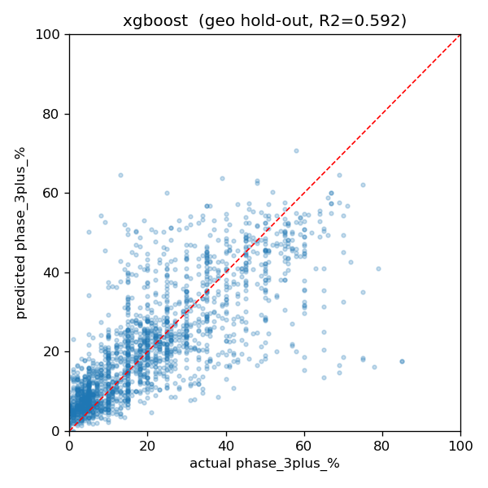

### Driver hierarchy

Based on mean(|SHAP|) from XGBoost with Country included:

| Rank | Feature | Group | Mean \|SHAP\| |
|---|---|---|---|
| 1 | Country | context | 4.83 |
| 2 | IDP rate | displacement | 4.08 |
| 3 | ACLED political violence (per 100k) | conflict | 1.82 |
| 4 | WFP food price | prices | 1.21 |
| 5 | Year | context | 0.99 |
| 6 | ACLED total events (per 100k) | conflict | 0.91 |
| 7 | Rainfall 1m (raw) | climate | 0.85 |
| 8 | Rainfall 1m sum | climate | 0.77 |
| 9 | NDVI (vim) | vegetation | 0.70 |
| 10 | NDVI (viq) | vegetation | 0.61 |

Rainfall, NDVI vegetation health and food prices all sit in the top 10 behind the two dominant
drivers, Country and IDP rate.

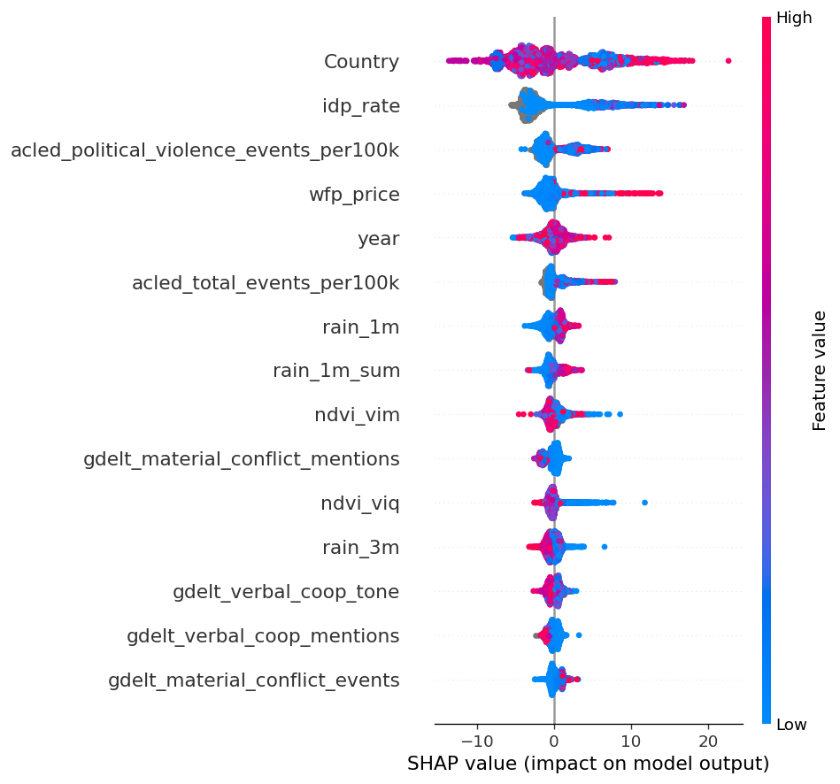

### Country ablation

Removing the Country feature drops R² by 0.06–0.18 depending on the model, but boosters
still reach R² ≈ 0.54 without it — the physical and economic drivers carry genuine
cross-country signal and are not just proxies for "which country is this."

| Model | R² with Country | R² without | Drop |
|---|---|---|---|
| XGBoost | 0.608 | 0.551 | −0.057 |
| LightGBM | 0.621 | 0.549 | −0.072 |
| RandomForest | 0.601 | 0.504 | −0.097 |
| DecisionTree | 0.493 | 0.317 | −0.176 |

The SHAP ranking shifts substantially without Country. IDP rate becomes the dominant feature,
and `month` rises to #3 — seasonal patterns were previously masked by the country fixed-effect.

| | With Country | Without Country |
|---|---|---|
| Rank 1 | Country (4.83) | IDP rate (4.27) |
| Rank 2 | IDP rate (4.08) | ACLED violence (2.44) |
| Rank 3 | ACLED violence (1.82) | month (1.71) |
| Rank 4 | WFP price (1.21) | WFP price (1.23) |
| Rank 5 | Year (0.99) | rain_1m_sum (1.18) |

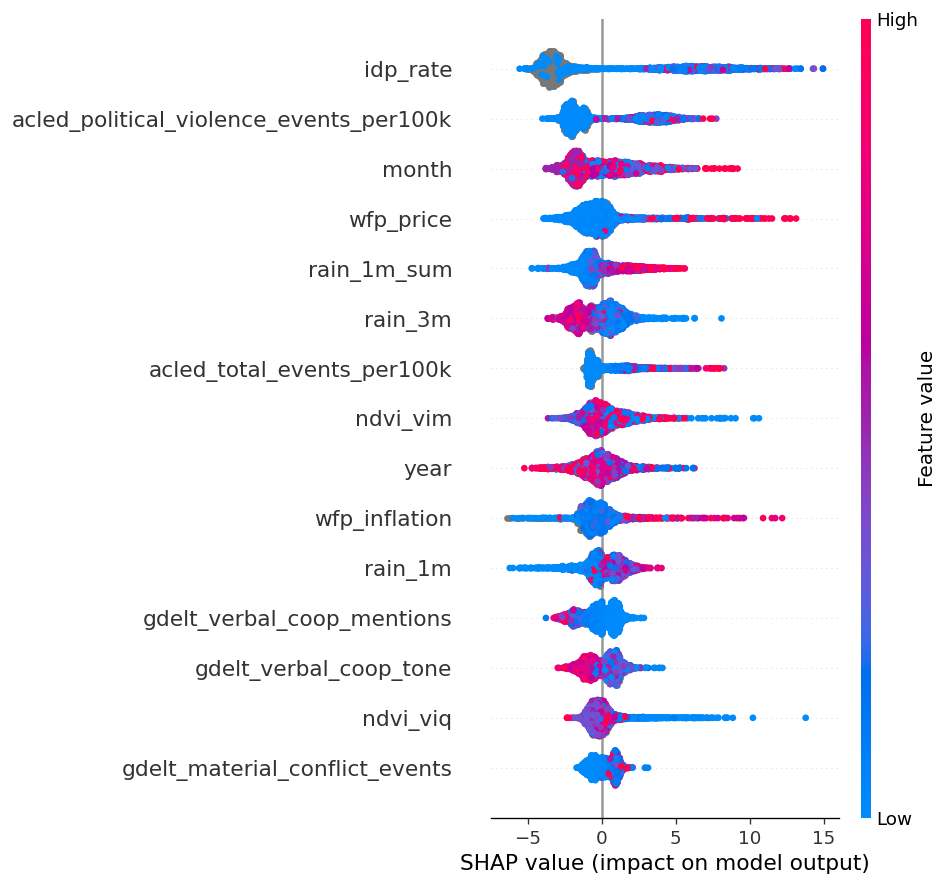

---

## Round 2 — Nowcasting (autoregressive panel)

*Can drivers beat simply carrying the last assessment forward?*

**Panels:** `panel_cur` (current windows only, 5,054 rows) vs `panel_all` (current + IPC
projection windows, 9,596 rows). Projections deduplicated with preference order
current > first projection > second projection.

**AR features added:** lag1, lag2, recent_trend (lag1−lag2), months_since_last,
is_projection flag.

**Validation:** rolling-origin backtest, 5 origins (2023-07 / 2024-01 / 2024-07 / 2025-01 /
2025-07), 6-month expanding test windows (n = 1,856 scored rows per cell). Primary cell:
train_all → eval current windows.

### Primary backtest results

| Model | MAE (pp) | RMSE (pp) | R² | Skill vs persistence |
|---|---|---|---|---|
| **Nowcast XGBoost** | **5.27** | **8.05** | **0.686** | **+16.0%** |
| Nowcast LightGBM | 5.30 | 8.08 | 0.684 | +15.5% |
| Nowcast RandomForest | 5.36 | 8.19 | 0.675 | +14.5% |
| Persistence (baseline) | 6.27 | 9.57 | 0.557 | — |
| Static XGBoost (no lag) | 6.13 | 8.70 | 0.633 | +2.3% |

The best overall model is `nowcast_delta` XGBoost (MAE **5.20**, R² **0.693**, skill **+17.0%**),
which adds driver *changes* to the levels — but the gain over plain nowcast is marginal (see below).
The static-driver model (no lag) clears persistence by **+2.3%**: the drivers carry genuine
standalone temporal value even before the lag is added.

### Country time series — actual vs walk-forward nowcast

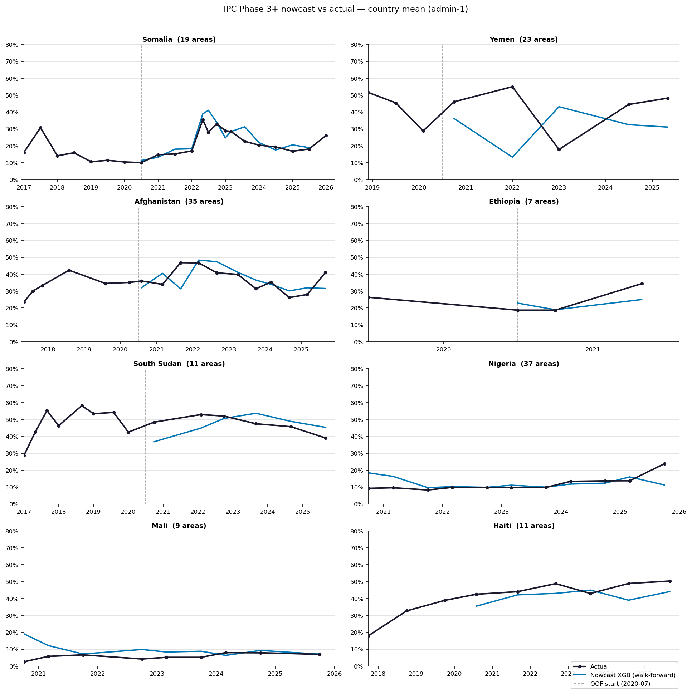

Each panel shows the country-mean **actual** IPC (black, dotted) against the **walk-forward
out-of-sample nowcast** (blue). Every prediction was made by a model trained only on data before
that fold's cutoff — the vertical dashed line marks the OOF start (2020-07). The viz uses an
extended 11-origin semi-annual backtest for full historical coverage.

### Admin-1 detail (per country)

Country means smooth over a lot: within one country some admin-1 areas track tightly while others
diverge. Each grid below shows every admin-1 area separately (actual vs walk-forward nowcast).

**Somalia**
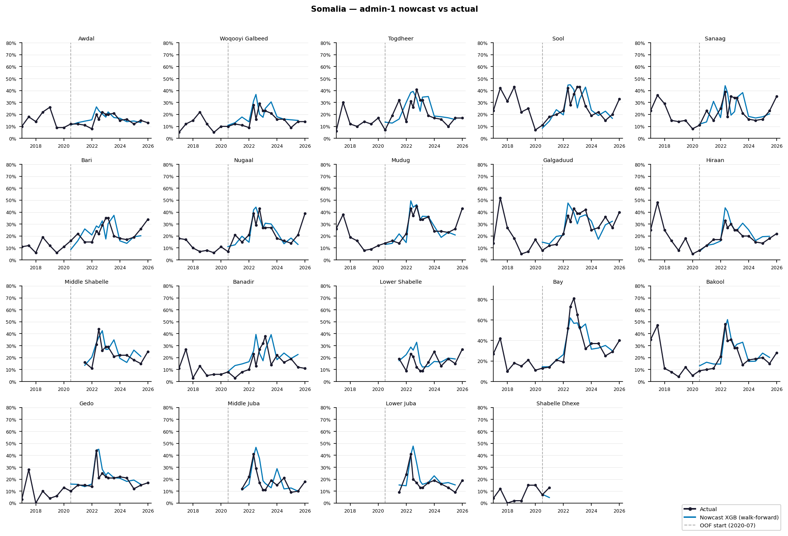

**Yemen**
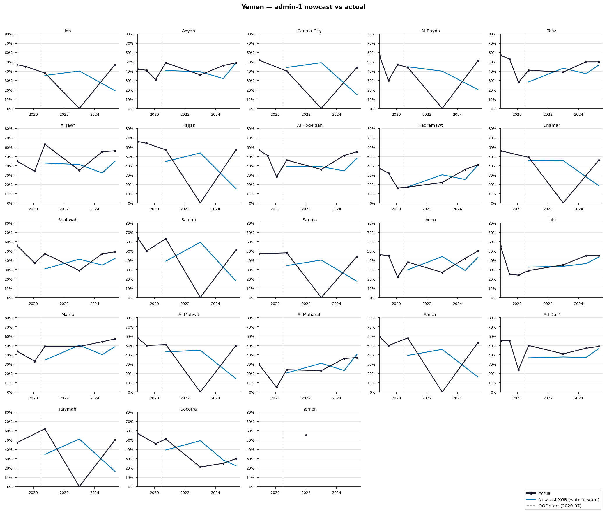

**Afghanistan**
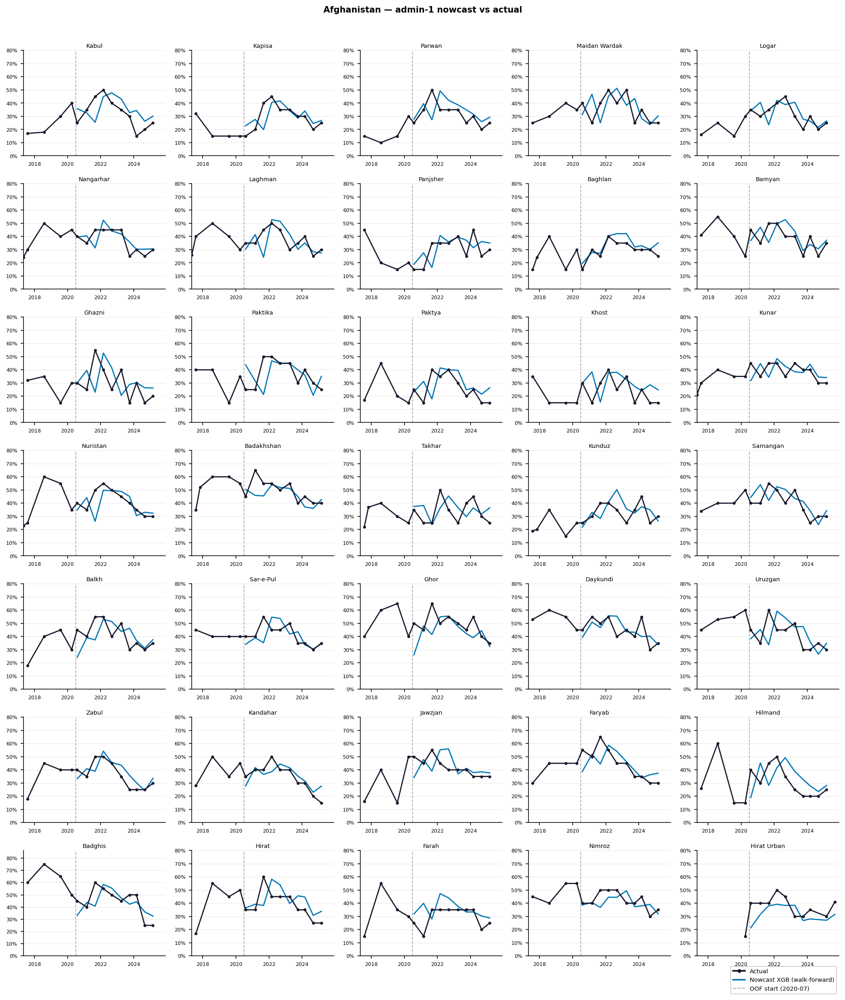

**Ethiopia**
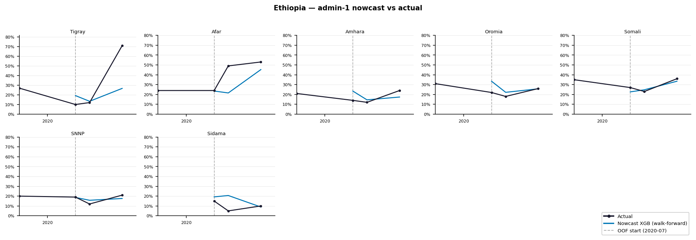

**South Sudan**
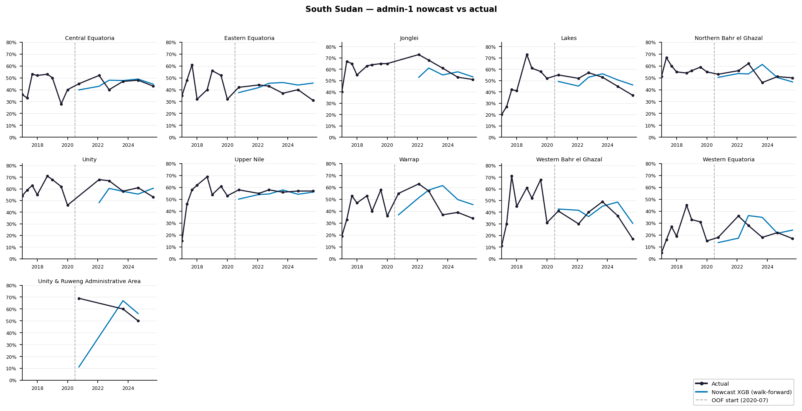

**Nigeria**
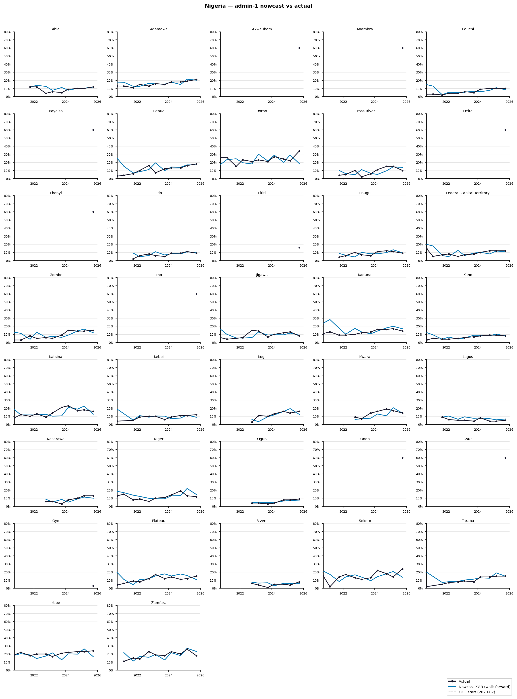

**Mali**
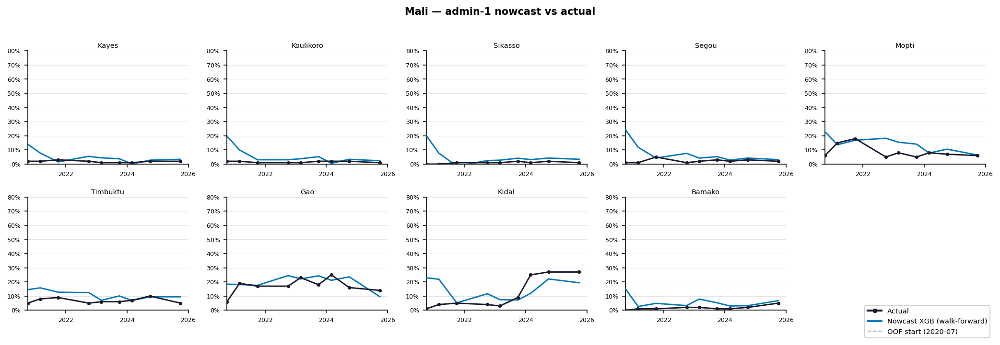

**Haiti**
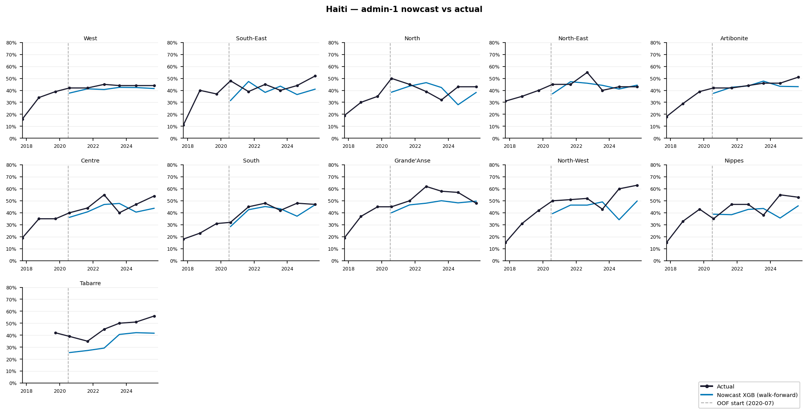

A single-country time series with a driver strip is also available in `ts_<country>.png`.

### Driver value decomposition

How much of the skill over persistence comes from the AR structure vs the exogenous drivers?
(XGBoost, train_all | eval_current)

| Stage | MAE (pp) | R² | Marginal MAE gain |
|---|---|---|---|
| Persistence | 6.27 | 0.557 | — |
| + AR structure (lag2, trend, gap) | 5.64 | 0.663 | −10.0% |
| + Driver levels | 5.27 | 0.686 | −6.7% |
| + Driver deltas | 5.20 | 0.693 | −1.2% |

**About two-thirds of the gain comes from richer autoregressive structure**; one-third from
exogenous driver levels. Driver *changes* (deltas) add little to headline accuracy despite the
rainfall-change term (`d_rain_1m`) ranking high in SHAP — largely redundant with levels + lag.

### Change-direction correlation

Because level R² is dominated by the lag, the honest measure of driver skill is how well
the model predicts the *direction and magnitude of change* since the last assessment.

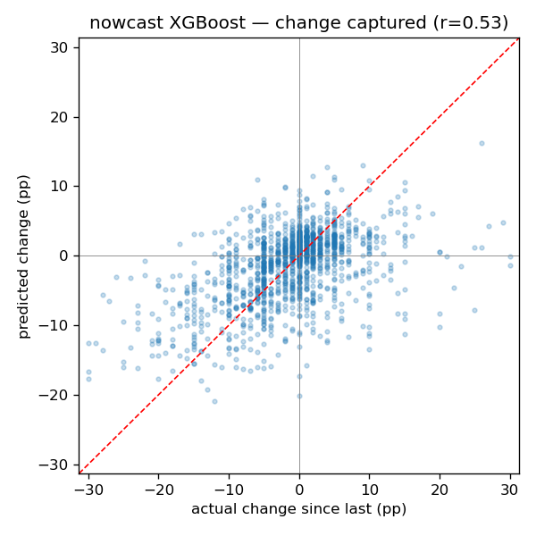

**r = 0.53** between predicted and actual change — the model gets the movement direction right
about half the time, the genuinely hard part of nowcasting.

### Feature importance (SHAP — nowcast XGBoost)

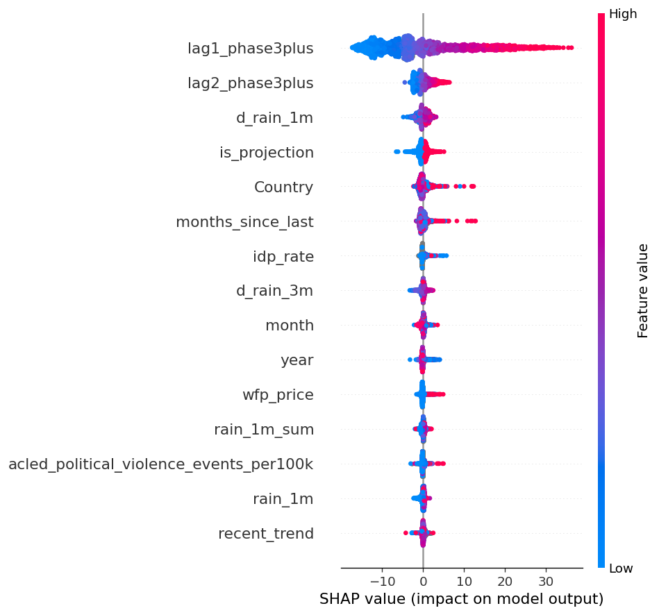

| Rank | Feature | Mean \|SHAP\| |
|---|---|---|
| 1 | lag1 IPC | 9.08 |
| 2 | lag2 IPC | 1.48 |
| 3 | **rainfall Δ1m** (`d_rain_1m`) | 1.08 |
| 4 | is_projection | 0.87 |
| 5 | Country | 0.74 |
| 6 | months_since_last | 0.61 |

The lag (`lag1_phase3plus`) dominates — ~6× the next feature. The strongest exogenous term is a
rainfall **change** (`d_rain_1m`, rank 3), a plausible fast signal of emerging rainfall shocks.
Country stays low (0.74 vs 4.83 in the static round): the lag already encodes each area's
structural level, making the fixed-effect largely redundant. `is_projection` and
`months_since_last` are data-provenance / recency terms, not food-insecurity drivers.

---

## Per-country performance

Per-country breakdowns expose that the **two rounds are complementary, not redundant** — they
succeed in almost opposite sets of countries.

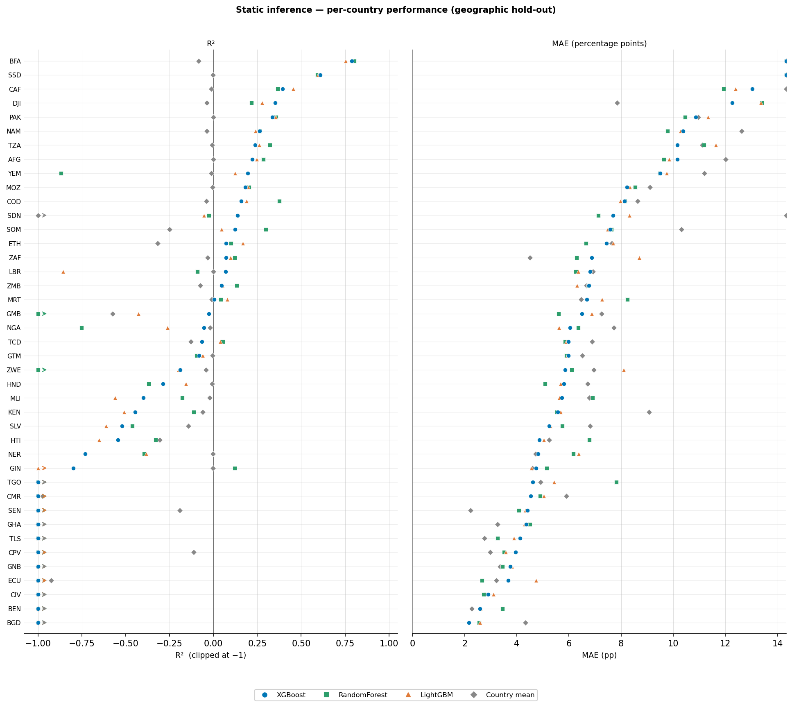

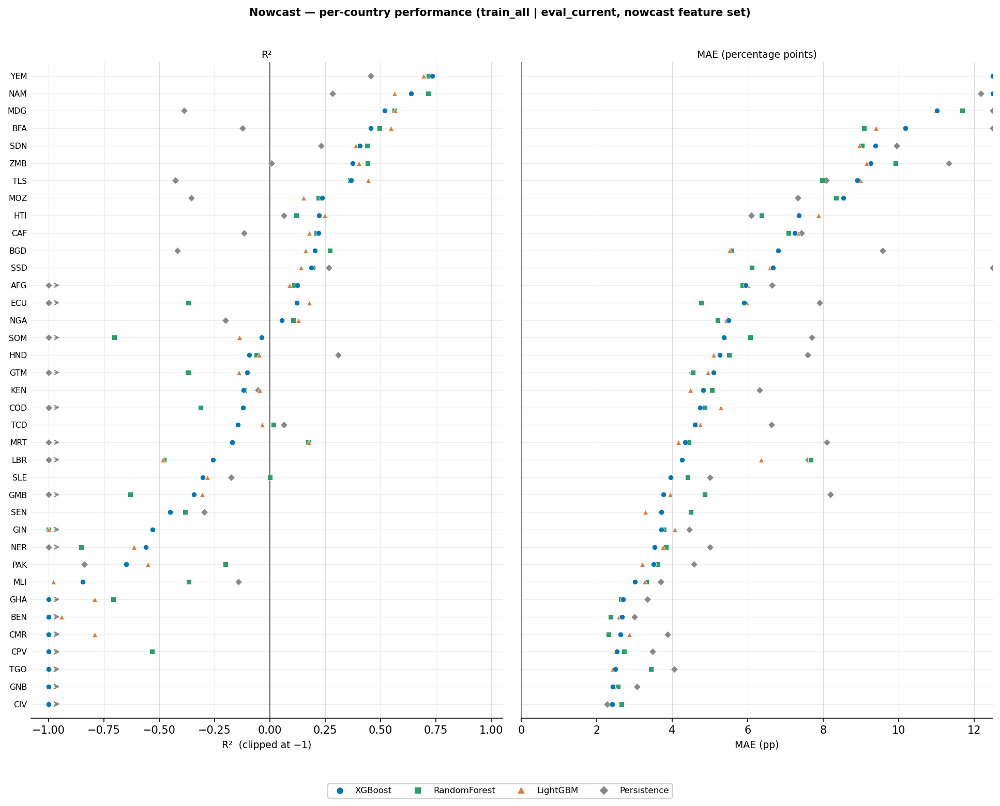

### The reversal

| Country | Static R² | Nowcast R² | Reading |
|---|---|---|---|
| MLI | −39 | **+0.73** | No cross-area driver signal, but strong temporal structure |
| CMR | −1.72 | **+0.64** | Same |
| SSD | −0.52 | **+0.52** | Uniform extreme IPC → no spatial variance, but predictable over time |
| KEN | **+0.61** | **+0.46** | Works in **both** — real spatial *and* temporal signal |
| SDN | **+0.79** | +0.05 | Strong spatial contrast; too fast-moving to nowcast |
| NGA | **+0.39** | −0.09 | Spatial driver signal; abrupt temporal dynamics |
| YEM | **+0.26** | −6.34 | Some spatial pattern; chaotic, non-smooth temporal dynamics |

**Static** works where drivers explain *why one area is worse than another* (cross-sectional
heterogeneity): SDN (0.79), KEN (0.61), NGA (0.39), SOM (0.34), YEM (0.26). It collapses
(R² ≪ 0) where the IPC pattern across areas doesn't resemble training countries — MLI (−39),
SEN (−12), BFA (−5.3). But note this single-split blow-up is partly a *validation* artifact:
under 5-fold GroupKFold (each area tested once, more of its neighbours in training) MLI recovers
to +0.17 — see Round 3.

**Nowcast** works where temporal persistence and change explain *whether a situation is
deteriorating* (intertemporal dynamics): MLI (0.73), CMR (0.64), SSD (0.52), KEN (0.46). Its
real value shows where even *persistence is negative* — KEN (persist −0.12 → nowcast +0.46),
SSD (−0.39 → +0.52), TCD (−1.21 → +0.12) — capturing direction of change in volatile contexts.

**Hard in both rounds:** YEM, SEN, MDG — idiosyncratic dynamics (war escalation, or very
low/stable IPC that a global model systematically overshoots) that neither spatial generalisation
nor temporal AR structure can anticipate.

> **Note on the R²/MAE mismatch:** high-R² countries often show *higher* MAE. R² is relative
> (variance explained); MAE is absolute (pp). Crisis countries with large IPC swings score high
> R² but still carry 5–10pp errors, while stable low-IPC countries have tiny MAE yet R² near zero.
> The two are not comparable across countries with different IPC variance.

---

## Round 3 — Localization (regional & per-country models)

*Does localizing the model beat one global model?*

For both rounds we compared three training **scopes** for XGBoost — **global** (all countries),
**regional** (6-region map), **local** (per country) — under each round's native validation
(static: GroupKFold by area; nowcast: rolling-origin backtest). The "global" baseline here uses
GroupKFold so all three scopes are measured identically (numbers differ slightly from the headline
single-split geo hold-out).

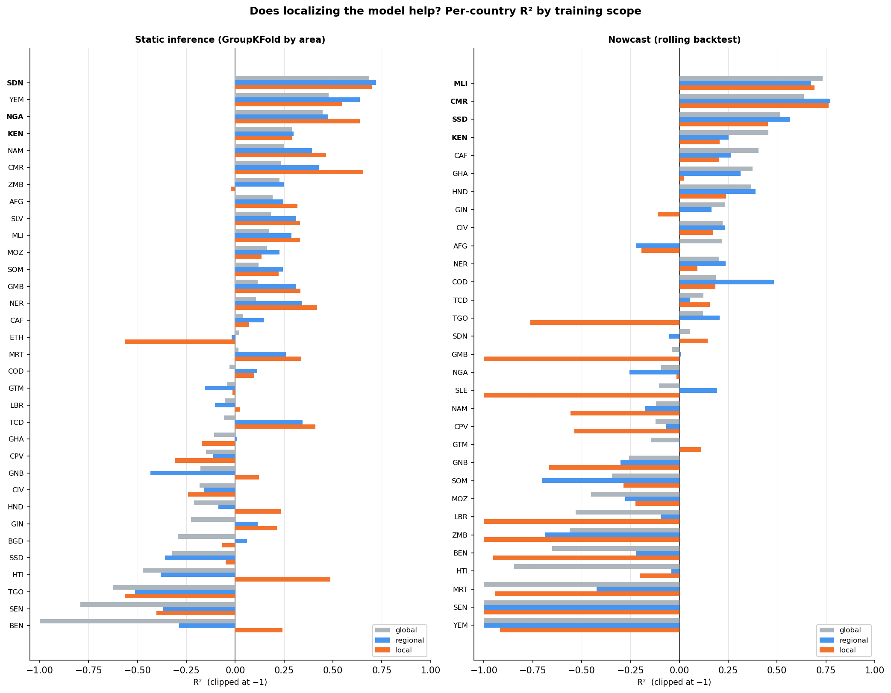

**Static — localizing is a broad win.** Regional beats global in **33/47** countries; local in
**26/33** (of those with enough data). Large lifts: NGA 0.45→**0.64** (local), CMR 0.23→**0.66**
(local), TCD −0.06→**0.41** (local), HTI −0.47→**0.49** (local), NER 0.11→**0.42** (local),
YEM 0.48→**0.64** (regional). Because the *driver → IPC* mapping is country/region-specific, a
homogeneous scope helps almost everywhere. (This also explains the MLI −39 blow-up: its GroupKFold
global is already +0.17, and local lifts it to +0.33 — the catastrophe was a single-split artifact,
not a modelling failure.)

**Nowcast — localizing mostly hurts.** Regional beats global in only **22/37**; local in only
**10/31**. The strong countries stay best **global** (MLI 0.73, KEN 0.46, CAF 0.41, GHA 0.37,
AFG 0.22), because the nowcast's power is the **autoregressive** structure — a universal dynamic
that simply wants more training data; splitting starves it. Localizing helps only where a whole
region shares dynamics: **CMR 0.64→0.77** and **COD 0.19→0.49** (both regional, Central Africa).

**Recommendation:**
- **Static → deploy regional or per-country models** (clear winners: NGA, CMR, TCD, HTI, NER, NAM, MLI).
- **Nowcast → keep one global model**; carve out a **regional** model only for Central Africa (CMR, COD).

This asymmetry is the headline result: *cross-sectional* driver relationships are local, but
*temporal* IPC dynamics are universal.

---

## Summary comparison

| | Static inference | Nowcasting |
|---|---|---|
| Question | Why is one area worse than another? | Is this area deteriorating? |
| Validation | Geographic hold-out | Rolling-origin backtest (5 origins) |
| Best R² | 0.597 (RandomForest, geo) | 0.693 (XGBoost `nowcast_delta`, OOF) |
| Best MAE | 7.48 pp | 5.20 pp |
| Best RMSE | 10.80 pp | 7.97 pp |
| Beats country-mean baseline? | Yes (+0.066 R²) | — |
| Beats persistence? | Marginally (+2.3% with drivers) | Yes (+17.0% skill) |
| Top driver | IDP rate | lag1 IPC (AR) |
| Country feature | Critical (−0.06 to −0.18 R²) | Near-redundant (0.74 SHAP) |
| Works best for | SDN, KEN, NGA, YEM | MLI, CMR, SSD, KEN |
| Best deployment scope | Regional / per-country | Global (regional for Central Africa) |

---

## Deferred

- Build the recommended **regional/per-country static** and **Central-Africa regional nowcast**
  models as deployable artifacts (Round 3 identified them; not yet packaged).
- Richer AR history (lag3, rolling mean/volatility, national-IPC context).
- Hyperparameter tuning, logit/sqrt target transform, ensembling.
- Delta-target nowcast variant (predict `target − lag1` directly).
- KNN + imputation round (missingness flags, denser coverage for WFP/IDP).
- Admin-2 level modelling; true forecasting; IPC's own projections as external benchmark.
