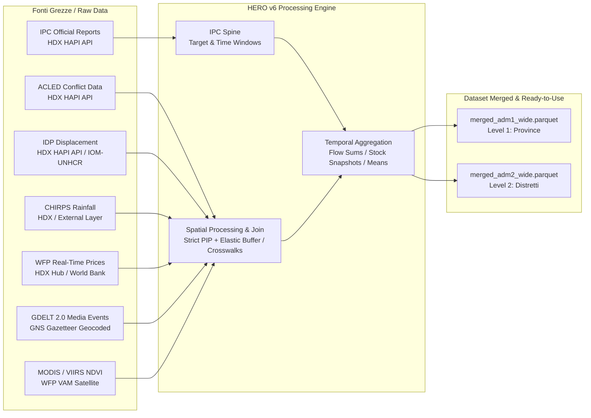
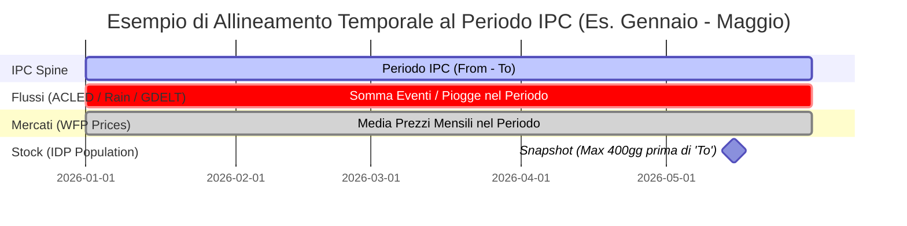

# Origine dei Dati e Metodologie di Aggregazione Spazio-Temporale (HERO v6)

Il presente documento descrive nel dettaglio l'architettura delle fonti informative integrate in **HERO v6** (Humanitarian Emergency Response Observatory), specificando la provenienza (download e acquisizione) dei singoli dataset grezzi e le rigorose metodologie di elaborazione applicate per la loro **aggregazione spaziale** e **allineamento temporale**.

---

## 1. Filosofia di Integrazione: L'Approccio "IPC Spine"

L'ecosistema di HERO v6 si basa sul principio architetturale della **Colonna Vertebrale IPC (*IPC Spine*)**. 
Poiché l'obiettivo analitico e predittivo del progetto è il monitoraggio dell'insicurezza alimentare (misurata dalle fasi IPC), tutte le fonti informative esplicative (conflitti, sfollamenti, clima, prezzi e media) vengono integrate tramite **Left Join** sulla struttura geografica (P-code) e temporale (finestre di validità `From` - `To`) definita dai report ufficiali IPC.

---

## 2. Fonti Dati: Provenienza e Acquisizione dei File

La tabella seguente riassume la provenienza di ciascun layer informativo, il canale di acquisizione e la granularità nativa:

| Layer / Tema | Fonte Originale / Fornitore | Canale di Download / Acquisizione in HERO | Formato & Granularità Nativa | Script di Acquisizione / Rif. |
| :--- | :--- | :--- | :--- | :--- |
| **IPC** *(Spine)* | **OCHA / IPC Global Platform** | **HDX HAPI API** *(Humanitarian API)* | Valutazioni periodiche per territorio amministrativo (ADM1 o ADM2) | [fetch.py](file:///c:/Dev/Progetti/HERO/hero_v6/fetch.py) $\rightarrow$ `data/raw/ipc.parquet` |
| **ACLED** *(Conflitti)* | **ACLED Project** *(Armed Conflict Location & Event Data)* | **HDX HAPI API** | Registro eventi puntuali con coordinate GPS (`lat`/`lon`) e data esatta | [fetch.py](file:///c:/Dev/Progetti/HERO/hero_v6/fetch.py) $\rightarrow$ `data/raw/acled.parquet` |
| **IDP** *(Sfollati)* | **IOM DTM / UNHCR / OCHA** | **HDX HAPI API** | Snapshot periodici di stock della popolazione sfollata per P-code | [fetch.py](file:///c:/Dev/Progetti/HERO/hero_v6/fetch.py) $\rightarrow$ `data/raw/idp.parquet` |
| **Rainfall** *(Piogge)* | **CHIRPS** *(UC Santa Barbara / NOAA / USGS)* | Layer pre-elaborato su HDX / Ingestione esterna | Raster climatici grigliati aggregati per mese e poligono amministrativo | Fornito in `data/raw/rainfall.parquet` |
| **WFP Food Prices** | **World Food Programme (WFP)** / World Bank | Hub **HDX** ([Global WFP food prices](https://data.humdata.org/dataset/global-wfp-food-prices)) | Serie mensili per mercato fisico puntuale (`lat`/`lon`) in formato Wide | Script in `hero_v5/libs/` $\rightarrow$ `data/raw/wfp_with_pcodes.parquet` |
| **GDELT** *(Media Signals)* | **GDELT 2.0 Project** *(Global Database of Events...)* | Google BigQuery / Estrazione massiva GDELT | Eventi giornalieri geocodificati tramite gazetteer GNS / NGA | Fornito in `data/raw/df_gdelt4_adm{1,2}.parquet` |
| **NDVI** *(Vegetazione)* | **MODIS / VIIRS (NASA/NOAA)** tramite **WFP VAM** | Hub HDX / Elaborazioni satellitari WFP VAM | Indici vegetazionali decadali (ogni 10 gg) o mensili pesati su pixel agricoli | Fornito in `data/raw/wfp_ndvi.parquet` |
| **Confini Geografici** | **OCHA COD-AB** *(Common Operational Datasets)* | **HDX** (Shapefiles / GeoJSON ufficiali) | Poligoni vettoriali ufficiali per Admin-1 (Province) e Admin-2 (Distretti) | cartella `data/boundaries/` |

> [!NOTE]
> **Automazione del Download**: I tre dataset principali (IPC, ACLED, IDP) vengono scaricati o aggiornati automaticamente invocando lo script globale [fetch.py](file:///c:/Dev/Progetti/HERO/hero_v6/fetch.py), che interroga l'API HAPI di HDX per i 52 paesi target stabiliti in [config.py](file:///c:/Dev/Progetti/HERO/hero_v6/config.py) a partire dall'anno 2017. I dataset atmosferici, satellitari e dei mercati WFP risiedono come input contrattuali in `data/raw/`.

---

## 3. Metodologia di Aggregazione e Processing Spaziale

L'allineamento geografico tra fonti che nascono con nature differenti (punti GPS, rasters continui, poligoni amministrativi discordanti) costituisce una delle fasi più complesse della pipeline di HERO v6, gestita dal motore di unione [merge.py](file:///c:/Dev/Progetti/HERO/hero_v6/merge.py).

### 3.1 Separazione Parallela ADM1 e ADM2 (Nessun Fallback Verticale)
Per preservare la purezza statistica delle analisi, HERO v6 genera **due dataset paralleli ed indipendenti**:
* `merged_adm1_wide.parquet`: Tutte le aggregazioni spaziali sono calcolate rigorosamente ai confini provinciali (`adm1_pcode`).
* `merged_adm2_wide.parquet`: Tutte le aggregazioni sono calcolate ai confini distrettuali (`adm2_pcode`).
* **Regola architetturale**: Non esiste alcun fallback verticale tra i due livelli. Se una valutazione IPC è nativa a livello distrettuale (ADM2), viene unita esclusivamente con i dati climatici, di conflitto e di mercato calcolati per quel distretto. In questo modo si evitano distorsioni ecologiche e il raddoppio improprio di variabili provinciali su unità distrettuali.

### 3.2 Spatial Join e Point-in-Polygon (PIP) con Elastic Buffer (WFP Food Prices)
I dati dei prezzi alimentari del WFP sono registrati su singoli mercati fisici identificati da coordinate GPS (`lat`, `lon`). L'associazione di ciascun mercato al rispettivo codice amministrativo OCHA (P-code) avviene tramite lo script di pre-processing [wfp_spatial_mapping.py](file:///c:/Dev/Progetti/HERO/hero_v5/libs/wfp_spatial_mapping.py) (ereditato da HERO v5):
1. **Strict Point-in-Polygon (PIP)**: Si esegue un test geometrico rigoroso (`gpd.sjoin(..., predicate="within")`) tra le coordinate del mercato e i poligoni OCHA COD-AB.
2. **Fallback con Elastic Buffer (0.05°)**: I mercati che falliscono il test stretto (tipicamente mercati costieri, isolani o di frontiera le cui coordinate GPS cadono in mare o pochi metri fuori dal confine digitale per imprecisione cartografica) vengono recuperati espandendo i confini del poligono con un buffer elastico di **0.05 gradi sessagesimali** ($\approx$ 5–5.5 km).
3. **Tracciamento della Strategia**: In ogni record WFP viene iniettata la colonna `mapping_method_adm{1,2}` (`strict_pip`, `elastic_buffer` o `unmapped`). In fase di aggregazione, la funzione `aggregate_wfp` in [merge.py](file:///c:/Dev/Progetti/HERO/hero_v6/merge.py) propaga questo segnale al dataset finale (conservando il metodo più "critico" utilizzato tra i mercati che hanno contribuito alla media di quel territorio).

### 3.3 Spatial Join con Nearest Neighbor Fallback (GDELT)
Gli articoli di cronaca elaborati da GDELT contengono coordinate GPS dedotte automaticamente dal testo tramite il gazetteer GNS (National Geospatial-Intelligence Agency).
* Dopo il PIP primario (`within`) con i confini OCHA ADM1/ADM2, gli eventi non abbinati (spesso perché le coordinate corrispondono al centroide della città o del paese) vengono recuperati tramite un **Fallback Nearest Neighbor entro un raggio di 20 km**.
* Gli eventi che distano più di 20 km dai confini ufficiali (es. piccole nazioni insulari) vengono scartati per evitare rumore geospaziale.
* *Nota*: Nel dataset fuso definitivo, le variabili GDELT sono esposte esclusivamente nel file `merged_adm1_wide.parquet` per garantire una densità statistica robusta delle menzioni mediatiche.

### 3.4 Riconciliazione Geografica dei P-code (IDP & ACLED)
* Per il layer **IDP** (sfollati interni), i dati raw provengono già con codici di area. Tuttavia, per superare disallineamenti di spelling, zeri iniziali mancanti (es. `SO-01` vs `SO01`) o codifiche OCHA deprecate, la pipeline implementa logiche di pulizia e cross-walk delle chiavi primarie prima del join.
* Per **ACLED**, l'aggregazione avviene raggruppando gli eventi geolocalizzati per i codici amministrativi (`admin1_code` / `admin2_code`) normalizzati sui P-code standard della spina dorsale IPC.

### 3.5 Aggregazione Spaziale da Raster (Rainfall & NDVI)
* **Rainfall (CHIRPS)**: I raster di precipitazione vengono ritagliati sulla geometria di ciascuna unità amministrativa (ADM1 o ADM2) calcolando la pioggia media areale ricadente all'interno del poligono.
* **NDVI (WFP VAM)**: L'indice di vigore e anomalia vegetazionale (già a livello di P-code nei pre-processing satellitari WFP) è ottenuto come **media pesata sul numero di pixel agricoli (`n_pixels`)** attivi nell'area amministrativa, escludendo deserti, foreste non agricole e specchi d'acqua.

---

## 4. Metodologia di Aggregazione e Processing Temporale

Una volta stabilita l'appartenenza geografica al P-code, le variabili esterne devono essere condensate all'interno delle finestre temporali dell'IPC. 

Le valutazioni IPC non hanno cadenza mensile regolare, ma coprono intervalli specifici (es. da gennaio a maggio per la situazione *Current*, da giugno a settembre per la *First Projection*). Tali intervalli sono definiti esplicitamente dalle colonne **`From`** (data inizio validità) e **`To`** (data fine validità).

La funzione di merge in [merge.py](file:///c:/Dev/Progetti/HERO/hero_v6/merge.py) applica logiche temporali differenziate in base alla **natura economica e fisica** della variabile da integrare:

### 4.1 Variabili di Flusso (*Flow Data*: ACLED, Rainfall, GDELT)
Trattandosi di eventi cumulabili o grandezze atmosferiche continue, il processing temporale aggrega le osservazioni che ricadono nell'intervallo chiuso `[From, To]`:
* **ACLED**: Si calcola la **somma totale** degli eventi di violenza politica, manifestazioni e vittime (`sum(events)`, `sum(fatalities)`) avvenute tra la data `From` e la data `To`.
* **Rainfall**: Si estrae la **somma accumulata delle precipitazioni** (`rain_1m_sum` in mm) cadute nel periodo, unitamente alle medie mensili (`rain_1m`, `rain_3m`) e allo scostamento/anomalia rispetto alla climatologia storica di quel preciso periodo dell'anno (`rain_anomaly_1m`, `rain_anomaly_3m`).
* **GDELT**: Si calcola la **somma** dei conteggi di eventi e menzioni giornaliere nel periodo. Per l'indicatore di tono mediatico (`_tone`), per evitare distorsioni da giornate con poche notizie, si calcola la **media pesata sul numero delle menzioni** (`weighted_mean(tone, weights=mentions)`).

### 4.2 Variabili di Stato / Mercato (*Continuous / Monthly Means*: WFP Food Prices, NDVI)
Queste variabili riflettono le condizioni socio-economiche o ambientali costanti e monitorate su base mensile o decadale:
* **WFP Food Prices**: Vengono selezionate tutte le rilevazioni di mercato mensili comprese tra `From` e `To`. Per ciascun P-code, si calcola la **media aritmetica dell'indice dei prezzi (`wfp_price`) e dell'inflazione (`wfp_inflation`)**, registrando in `wfp_obs_count` il numero di mercati-mese che hanno contribuito alla stima.
* **NDVI**: Le rilevazioni decadali (3 per mese) cadenti nel periodo `From` - `To` vengono intermediate calcolando la greenness media del periodo (`ndvi_vim`) e l'anomalia media rispetto al profilo di normalità stagionale (`ndvi_viq`).

### 4.3 Variabili di Stock con Soglia di Obsolescenza (*Stock Data*: IDP)
La popolazione di sfollati interni rappresenta uno "stock" (fotografia statistica della popolazione presente in un dato istante), non un flusso da sommare nel tempo.
* **Logica Snapshot**: Si seleziona l'**ultimo snapshot disponibile** (valutazione DTM/UNHCR più recente) la cui data di rilascio è antecedente o uguale alla fine del periodo IPC (`snapshot_date <= To`).
* **Soglia di Obsolescenza (*Staleness Cap* - 400 Giorni)**: Per evitare che un'analisi IPC moderna venga inquinata da stime IDP vecchie di anni (in paesi dove i censimenti sugli sfollati sono rari), la pipeline impone una soglia rigida:
  $$\text{Staleness Days} = \text{To} - \text{Date}_{\text{IDP Snapshot}}$$
  Se $\text{Staleness Days} > 400$, il dato viene considerato obsoleto e **scartato** (lasciando la cella a `NaN`). Se il dato è valido ($\le 400$ giorni), il numero di sfollati viene aggregato e il ritardo temporale viene salvato nella colonna `idp_staleness_days` in modo che l'informazione di lag accompagni sempre il dato analitico.

---

## 5. Riformattazione per ML e TSA (Widen & Uniform Monthly Grid)

I due dataset principali in uscita dalla pipeline di fusione sono in formato "Long". A valle del merge, subiscono ulteriori elaborazioni di trasformazione temporale per servire i diversi motori analitici di HERO v6:

1. **Pivot in Formato Wide ([widen.py](file:///c:/Dev/Progetti/HERO/hero_v6/widen.py))**:
   I dati nativi presentano una riga per ogni singola *fase* IPC. Lo script di widen effettua il pivot del dataset, espandendo le fasi su colonne parallele (`phase_1_number`, `phase_2_number`, ..., `phase_3plus_percentage`). Il risultato sono i due file pronti all'uso inclusi nella cartella `data/merged/`: **`merged_adm1_wide.parquet`** e **`merged_adm2_wide.parquet`**, aventi una sola riga per combinazione `(Area, Periodo IPC)`.

2. **Riallineamento Temporale Uniforme per TSA & Forecasting**:
   Per la **Time Series Analysis (TSA)** e la predizione quantitativa (*Nowcasting/Forecasting*), gli algoritmi di machine learning (es. SARIMAX, clustering autoregressivo, reti neurali) richiedono serie storiche campionate a intervalli regolari e senza buchi. Poiché i report IPC vengono rilasciati 2–3 volte l'anno, i dati wide vengono sottoposti a un processing temporale aggiuntivo:
   * **Espansione su Griglia Mensile (`MS` - Month Start)**: Le finestre di validità `From` - `To` vengono esplose su tutti i singoli mesi di calendario inclusi nell'intervallo.
   * **Imputazione Temporale e Trattenimento**: I mesi privi di survey IPC attive vengono valorizzati tramite **interpolazione lineare** (per l'evoluzione fluida delle percentuali IPC) oppure tramite **forward-fill / backward-fill** (`ffill` / `bfill`) per trasportare l'ultima valutazione nota fino all'avvento del nuovo report. I layer ad alta frequenza (piogge CHIRPS, prezzi WFP mensili, eventi ACLED) conservano invece la loro granularità mensile esatta, creando un panel socio-ambientale continuo ad altissima risoluzione temporale.
   * **Imputazione Geospaziale (KNN / Joint Scaling)**: Come documentato in [DATASET_DESCRIPTION.md](file:///c:/Dev/Progetti/HERO/hero_v6/data/merged/DATASET_DESCRIPTION.md), per coprire eventuali lacune residue nei dati climatici o dei mercati di specifiche province senza rompere le correlazioni spaziali, vengono generati dataset arricchiti (`merged_adm1_wide_knn.parquet`) applicando l'algoritmo **KNN Imputer** sulle coordinate spaziali standardizzate del centroide del territorio.
