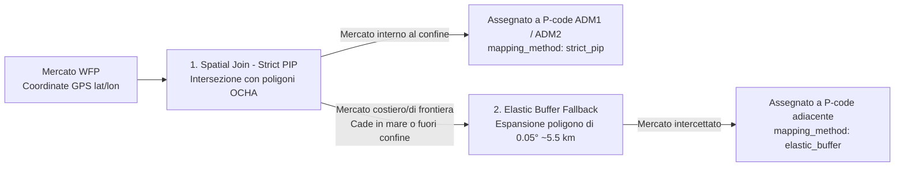

# World Food Programme (WFP) - Real-Time Food Prices
## Fonte Dati e Metodologia di Spatial Join e Processing (HERO v6)

Questo documento sintetizza la provenienza dei dati sui prezzi alimentari del **World Food Programme (WFP)** e la logica di **spatial join** adottata per assegnare i mercati fisici alle unità amministrative territoriali (**ADM1** e **ADM2**), allineandoli poi temporalmente alla spina dorsale di **IPC**.

---

## 1. Fonte Dati e Struttura
* **Risorsa Utilizzata**: I dati grezzi sono stati scaricati dall'hub umanitario HDX al seguente indirizzo ufficiale:
  **[Global WFP food prices (Humanitarian Data Exchange)](https://data.humdata.org/dataset/global-wfp-food-prices)**
* **Formato Nativo (Wide Format)**: Il dataset originale si presenta in formato *Wide*, dove ogni riga corrisponde allo stato di un **singolo mercato fisico in un determinato mese**, con le serie storiche dei singoli beni alimentari (grano, riso, ecc.) esposte su colonne parallele.
* **Variabili Core per HERO v6**: Dalle centinaia di colonne disponibili, la pipeline estrae e sintetizza i due indici macroeconomici aggregati del paniere alimentare:
  1. **`food_price_index`**: L'indice generale del livello dei prezzi alimentari del mercato.
  2. **`inflation_food_price_index`**: Il tasso di inflazione alimentare generale.

---

## 2. Il Concetto di Spatial Join: Assegnazione alle ADM1 e ADM2

I mercati del WFP sono entità puntuali geolocalizzate tramite coordinate GPS esatte (**`lat`**, **`lon`**), mentre le valutazioni IPC e l'architettura di HERO si strutturano su poligoni amministrativi ufficiali OCHA: le province (**Admin Level 1 / ADM1**) e i distretti (**Admin Level 2 / ADM2**).

Per assegnare in modo automatico e preciso ogni mercato alla propria provincia e distretto di appartenenza, è stato implementato un algoritmo di **Spatial Join** geospaziale nello script di pre-processing [wfp_spatial_mapping.py](file:///c:/Dev/Progetti/HERO/hero_v5/libs/wfp_spatial_mapping.py):

### 2.1 1° Step: Spatial Join Stretto (Point-in-Polygon - PIP)
Si esegue un'operazione di intersezione spaziale standard (`gpd.sjoin(..., predicate="within")`) tra il livello puntuale dei mercati e gli shapefile poligonali OCHA COD-AB. 
* Se la coordinata GPS ricade esattamente all'interno del poligono di un distretto, il mercato viene assegnato univocamente alle chiavi **`adm1_pcode`** e **`adm2_pcode`** di quel territorio.
* Il record viene etichettato con la colonna diagnostica `mapping_method_adm{1,2} = 'strict_pip'`.

### 2.2 2° Step: Fallback con Elastic Buffer (0.05°)
A causa di lievi imprecisioni dei GPS locali o perché i confini digitali ufficiali sono ritagliati rigidamente lungo la linea di costa o i fiumi di confine, diversi mercati (soprattutto portuali, isolani o di frontiera) rischiano di cadere pochi metri fuori dal poligono amministrativo, finendo scartati come "orfani".
* Per recuperare queste risorse preziose, per i mercati non accoppiati dal PIP stretto si applica un **buffer elastico di 0.05 gradi sessagesimali** (pari a circa **5–5.5 km** sul terreno), espandendo i confini del poligono OCHA.
* Eseguendo lo spatial join sul poligono espanso, il mercato costiero o di frontiera viene agganciato al territorio amministrativo contiguo ed etichettato con `mapping_method_adm{1,2} = 'elastic_buffer'`.

---

## 3. Aggregazione Temporale sull'IPC Spine

Una volta che lo **spatial join** ha assegnato a ciascun mercato le chiavi amministrative regionali (`adm1_pcode`) e distrettuali (`adm2_pcode`), i dati dei prezzi devono essere condensati temporalmente per allinearsi alle finestre di validità dell'**IPC** (colonne **`From`** e **`To`**, di durata variabile tra 3 e 6 mesi).

Per ogni territorio e periodo IPC, la funzione `aggregate_wfp` in [merge.py](file:///c:/Dev/Progetti/HERO/hero_v6/merge.py) esegue una doppia aggregazione:
1. **Selezione delle Rilevazioni**: Vengono incluse tutte le osservazioni mensili di tutti i mercati assegnati a quel P-code in cui la data di rilevazione è compresa tra l'inizio (`From`) e la fine (`To`) della validità IPC.
2. **Medie e Conta delle Osservazioni**:
   * **`wfp_price`** e **`wfp_inflation`**: Media aritmetica degli indici di prezzo e di inflazione di tutti i mercati-mese selezionati nel territorio.
   * **`wfp_obs_count`**: Conteggio totale dei mercati-mese che hanno contribuito alla statistica. Questo proxy permette di pesare l'affidabilità statistica del dato nei modelli di Machine Learning.
   * **`wfp_mapping_method`**: Traccia la qualità geospaziale dell'aggregato (se anche un solo mercato nell'area ha utilizzato il buffer, l'intera cella viene etichettata come `elastic_buffer`).
