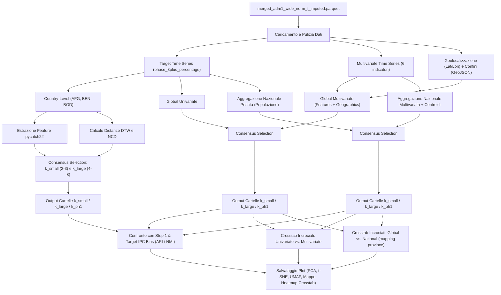

# Approfondimento Metodologico: Pipeline di Clustering delle Serie Storiche (Step 3)

Questo documento illustra nel dettaglio l'architettura scientifica e l'implementazione tecnica della pipeline di clustering delle serie storiche (Step 3) sviluppata per il progetto **HERO (Food Security Analysis)**.

---

## 1. Contesto del Progetto HERO

La pipeline di clustering si colloca all'interno del processo di imputazione e segmentazione della sicurezza alimentare articolato in tre fasi:
* **Fase 1**: Imputazione cross-sectional eseguita sui dati non correlati nel tempo, sfruttando relazioni spaziali e cluster statici (il dataset di partenza di Mattia).
* **Fase 2**: Imputazione basata sulle serie storiche (Nowcasting) che non tiene conto delle relazioni di vicinato o delle similarità globali.
* **Fase 3 (Corrente)**: Clustering dinamico sulle serie storiche completate nella Fase 2. L'obiettivo è identificare province e nazioni che condividono pattern temporali simili di insicurezza alimentare e confrontare questi raggruppamenti dinamici con i cluster statici della Fase 1.

---

## 2. Diagramma di Flusso della Pipeline (Mermaid)

Il seguente schema illustra l'intero flusso dei dati, dall'ingestione all'analisi comparativa finale:



---

## 3. Metodologia di Analisi Temporale e Spaziale

La pipeline supporta due filosofie di clustering per catturare similarità morfologiche e comportamentali:

### A. Clustering Basato su Feature (Feature-Based)
Si estraggono caratteristiche statistiche e dinamiche dalle serie storiche per mappare le curve in uno spazio vettoriale a dimensionalità fissa:
* **pycatch22**: Vengono calcolate 22 feature fondamentali che sintetizzano la distribuzione dei valori, le correlazioni lineari e non lineari, la linearità locale e le proprietà caotiche della serie.
* **Componente Spaziale (Geografica)**: Nelle analisi multivariate, le coordinate geografiche (latitudine/longitudine) vengono standardizzate separatamente e concatenate alle feature temporali per forzare una coerenza spaziale nel clustering globale.
* **Riduzione Dimensionale**: Si applicano **PCA** per la visualizzazione lineare, **t-SNE** per preservare le relazioni locali in dataset ad alta dimensionalità, e **UMAP** per mappare la topologia globale dello spazio delle feature.

### B. Clustering Basato sulla Forma (Shape-Based)
Misura la distanza morfologica diretta tra le traiettorie temporali:
* **Dynamic Time Warping (DTW)**: Trova l'allineamento ottimale non lineare nel tempo tra due curve, consentendo di identificare similarità anche in presenza di sfasamenti temporali o ritardi negli shock alimentari.
* **Normalized Compression Distance (NCD)**: Un approccio alternativo basato sulla teoria dell'informazione di Kolmogorov. Le serie vengono quantizzate e compresse (tramite *gzip*). Il rapporto di compressione congiunto funge da metrica di distanza non parametrica, molto sensibile a pattern ripetitivi e anomalie strutturali.
* **Algoritmo di Clustering Associato**: Poiché le distanze (DTW/NCD) vengono calcolate direttamente tra coppie di serie storiche, non disponiamo di coordinate spaziali esplicite ma solo di una matrice di distanza $D \in \mathbb{R}^{N \times N}$. Di conseguenza, si applica l'algoritmo gerarchico agglomerativo di Ward (descritto in 3.C.2), che opera nativamente su matrici di distanza senza richiedere il calcolo di centroidi vettoriali.

### C. Relazione tra Rappresentazione (3.A/3.B) e Algoritmo di Clustering (3.C)

La scelta dell'algoritmo di clustering non è arbitraria, ma è strettamente vincolata dalla natura dello spazio matematico definito nelle sezioni 3.A e 3.B:

| Rappresentazione Spaziale (Input) | Natura dello Spazio Metrico | Algoritmo di Clustering Scelto (Output) | Rationale Matematico |
| :--- | :--- | :--- | :--- |
| **Feature-Based (3.A)** | Spazio Euclideo esplicito: $\mathbb{R}^{22}$ (univariato) o $\mathbb{R}^{134}$ (multivariato) | **K-Means (3.C.1)** | Avendo coordinate vettoriali esplicite per ogni provincia, è possibile calcolare matematicamente il baricentro (media vettoriale) dei punti di un cluster per definire un centroide stabile ad ogni iterazione. |
| **Shape-Based (3.B)** | Matrice di distanza a coppie $D \in \mathbb{R}^{N \times N}$ (non euclidea / allineamenti non lineari) | **Agglomerative Hierarchical (3.C.2)** | Non essendoci uno spazio di coordinate vettoriali (ma solo distanze dirette come DTW o NCD), non è possibile calcolare medie aritmetiche per i centroidi. Il clustering gerarchico agglomerativo risolve questo limite operando unicamente sulle relazioni di distanza a coppie. |

#### 1. K-Means Clustering (Approccio Feature-Based - Univariato e Multivariato)

L'algoritmo **K-Means** viene applicato sulla matrice delle feature standardizzate estratte tramite `pycatch22`.
* **Come funziona**: Dato un numero di cluster $k$, K-Means posiziona $k$ centroidi casuali nello spazio multidimensionale e ottimizza ricorsivamente la loro posizione. Ad ogni iterazione, ciascun punto viene assegnato al centroide più vicino (distanza euclidea) e successivamente i centroidi vengono ricalcolati come media vettoriale dei punti assegnati. Il processo si arresta quando le assegnazioni non cambiano più.
* **Adattamento Multivariato + Geografico**: Per l'analisi multivariata, le 132 feature temporali e le 2 coordinate geografiche (Lat/Lon) vengono normalizzate in modo indipendente (z-score) prima di essere concatenate. Questo bilancia il peso delle variabili storiche ed evita che le coordinate dominino completamente il calcolo a causa di differenze di scala.

#### 2. Agglomerative Hierarchical Clustering (Approccio Shape-Based - DTW e NCD Univariati)
Per le distanze morfologiche dirette (dove non abbiamo coordinate vettoriali esplicite ma solo una matrice di distanza a coppie), si utilizza il **Clustering Gerarchico Agglomerativo** con il **criterio di linkage di Ward**.
* **Come funziona**: L'algoritmo parte da una configurazione in cui ogni singola provincia rappresenta un cluster a sé stante ($N$ cluster). Ad ogni passo, fonde la coppia di cluster che minimizza la varianza interna totale del sistema (ovvero l'aumento della somma dei quadrati delle distanze dai rispettivi baricentri, definito dal criterio di Ward).
* **Taglio dell'Albero (Flat Clustering)**: Il processo continua fino a formare un unico grande cluster, costruendo un albero gerarchico (dendrogramma). Per ottenere una partizione piatta con il numero di cluster desiderato ($k$), il dendrogramma viene "tagliato" orizzontalmente all'altezza che produce esattamente $k$ rami separati.

### D. Preservazione della Sequenzialità Temporale (Perché non è un clustering agnostico)

Un errore comune nell'analisi delle serie storiche è l'applicazione di algoritmi geometrici (come K-Means o il clustering gerarchico standard) direttamente sui vettori delle osservazioni grezze. Questo approccio è **temporaneamente agnostico**: tratta ciascun istante temporale $t_i$ come una coordinata ortogonale e indipendente. Se scambiassimo l'ordine cronologico delle colonne (shuffling temporale), le distanze euclidee tra le serie rimarrebbero identiche e l'algoritmo produrrebbe gli stessi identici raggruppamenti.

La pipeline HERO supera questo limite e preserva la **sequenzialità temporale** attraverso due canali metodologici distinti:

1. **La Codifica Dinamica delle Feature (pycatch22 + K-Means)**:
   Nell'approccio basato su feature, l'algoritmo K-Means non opera sui valori puntuali della serie storica, ma su indicatori che sintetizzano la dinamica del sistema. Molti dei 22 descrittori matematici di `pycatch22` dipendono esplicitamente dall'ordine temporale:
   * **Autocorrelazione e Memoria**: Feature come `CO_Embed2_Dist_tau` e `CO_FirstMin_ac` misurano le relazioni di lag (ritardo temporale), che esistono solo se l'ordine cronologico è intatto.
   * **Prevedibilità e Sequenzialità**: `FC_LocalSimple_mean1_tau` valuta l'errore di un modello predittivo locale a 1 passo. In una serie casualmente rimescolata, la prevedibilità scenderebbe a zero, modificando drasticamente la posizione del punto nello spazio delle feature.
   * In caso di rimescolamento delle osservazioni, le coordinate vettoriali di pycatch22 cambiano del tutto, portando a cluster finali differenti. La sequenzialità è quindi **matematicamente codificata all'interno dello spazio delle feature**.

2. **L'elasticità Morfologica Diretta (DTW e NCD + Hierarchical)**:
   Nell'approccio basato sulla forma, non si ricorre a nessuna semplificazione vettoriale:
   * **DTW (Dynamic Time Warping)**: Calcola la distanza allineando le serie sull'asse del tempo tramite un cammino di warping ottimale. L'allineamento rispetta rigorosamente la monotonicità temporale (il tempo scorre solo in avanti).
   * **NCD (Normalized Compression Distance)**: I compressori (come *gzip*) sfruttano algoritmi basati sulla ripetizione sequenziale di byte consecutivi (finestre scorrevoli LZ77). Una serie rimescolata ha un'entropia differente e una comprimibilità diversa, producendo distanze NCD distinte.


---

## 4. Selezione Automatica del Numero di Cluster ($k$)

Per superare la soggettività nella scelta del numero di cluster, la pipeline implementa una strategia robusta di **Rank Consensus** su tre criteri matematici:

1. **Silhouette Score ($S$)**: Misura quanto ciascun punto è simile al proprio cluster rispetto agli altri (massimizzato).
2. **Davies-Bouldin Index ($DB$)**: Valuta la compattezza interna dei cluster e la loro mutua separazione (minimizzato).
3. **Distanza dall'Elbow SSE ($d_{Elbow}$)**: Identifica il punto di flesso ("gomito") nella curva della somma degli errori quadratici (SSE). Viene calcolato geometricamente come la distanza ortogonale massima di ciascun punto $(k, SSE(k))$ dalla retta che connette il primo e l'ultimo punto della curva SSE.

### Algoritmo di Consensus:
Per ciascun $k$ nell'intervallo considerato, viene assegnato un rango (da 1 a $N$) per ciascuna metrica. Il $k$ ottimale è quello che minimizza il rango medio:
$$Consensus(k) = \frac{Rank_{Silhouette}(k) + Rank_{DB}(k) + Rank_{Elbow}(k)}{3}$$

La pipeline calcola sempre **due $k$ diversi** per garantire una doppia prospettiva di analisi:
* **$k_{small}$**: Selezionato nel range $[2, 3]$ per evidenziare macro-trend strutturali (es. Nord-Sud, aree stabili vs instabili).
* **$k_{large}$**: Selezionato nel range $[4, 8]$ per evidenziare micro-dinamiche locali o nicchie di vulnerabilità.
* **$k_{ph1}$ (Fase 1)**: Viene estratto dinamicamente il numero di cluster univoci presenti nella Fase 1 per quel dataset. Se non è già coperto da $k_{small}$ o $k_{large}$, viene eseguito un run dedicato salvato nella cartella `k_x_ph1` per un confronto diretto a parità di cluster.

---

## 5. Livelli di Aggregazione e Clustering

La pipeline scala l'analisi su tre livelli geografici:

* **Country-Level (Admin 1)**: Analisi interna a singoli paesi selezionati per la fase sperimentale (**Afghanistan (AFG)**, **Benin (BEN)**, e **Bangladesh (BGD)**). Consente di analizzare la dinamica provinciale accoppiata a mappe GeoJSON locali.
* **Global Level**: Tutte le 475 province del mondo analizzate simultaneamente:
  * *Univariate*: Solo sulla serie storica dell'IPC target.
  * *Multivariate*: Su tutti e 6 gli indicatori storici + coordinate geografiche.
* **National Level**: Le serie delle province vengono aggregate a livello nazionale tramite **medie pesate per la popolazione locale**. Questo riduce il rumore spaziale e permette di studiare il comportamento macroscopico di 35 paesi del mondo (sia in configurazione Univariata che Multivariata).

---

## 6. Schema di Validazione e Confronti Incrociati

La validazione scientifica dei cluster risultanti viene effettuata calcolando l'**Adjusted Rand Index (ARI)** e il **Normalized Mutual Information (NMI)** su quattro assi di confronto:

```
                  ┌──────────────────────────────────────────────┐
                  │              VALIDAZIONE STEP 3              │
                  └──────────────────────┬───────────────────────┘
                                         │
       ┌───────────────────┬─────────────┴───────┬───────────────────┐
       ▼                   ▼                     ▼                   ▼
┌──────────────┐   ┌───────────────┐   ┌───────────────────┐   ┌──────────────┐
│  vs Step 1   │   │  vs IPC Bins  │   │  Uni vs Multi     │   │ Global vs Nat│
└──────────────┘   └───────────────┘   └───────────────────┘   └──────────────┘
 Confronto con il   Confronto con le    Confronto tra i due     Confronto tra
 raggruppamento     fasce medie di      approcci (solo IPC      risultati su
 statico di Mattia  vulnerabilità IPC   vs tutti gli indici)    province vs nazioni
```

1. **Confronto con la Fase 1 (Step 1)**: Verifica se il comportamento temporale dinamico riflette la classificazione geografica statica iniziale.
2. **Confronto con le Classi IPC Medie (Low/Med/High)**: Verifica se i cluster temporali discriminano bene i livelli assoluti di insicurezza alimentare delle province.
3. **Confronto Univariato vs. Multivariato (Uni vs Multi)**: Evidenzia quanto l'aggiunta di variabili contestuali (prezzi, meteo, conflitti, sfollati) e della geografia alteri la struttura dei cluster rispetto alla sola osservazione del target IPC.
4. **Confronto Globale vs. Nazionale (Global vs Nat)**: Valutato proiettando il cluster dello stato su tutte le sue province e confrontandolo con il cluster calcolato a livello globale. Misura la coerenza interna dei paesi e l'impatto della granularità dei dati.

---

## 7. Metodologia di Confronto Multialgoritmico delle Strategie

La pipeline calcola e confronta sistematicamente diverse strategie di clustering. Per valutarle quantitativamente, viene applicata una metodologia di validazione a tre livelli:

### A. Qualità Interna (Compattezza nello Spazio delle Feature)
Le partizioni prodotte da ciascun algoritmo (anche quelle basate sulla forma come DTW o NCD) vengono valutate nello spazio standardizzato delle feature di `pycatch22` attraverso:
* **Silhouette Score**: Misura il grado di coerenza interna e di separazione tra cluster (range $[-1, 1]$, più alto è migliore).
* **Davies-Bouldin Index**: Valuta il rapporto tra le distanze intracluster e le distanze intercluster (range $[0, \infty[$, più basso è migliore).

### B. Validazione Esterna (Overlap con Ground-Truth)
Ciascun algoritmo viene confrontato tramite metriche di **ARI (Adjusted Rand Index)** e **NMI (Normalized Mutual Information)** contro:
* I cluster statici della Fase 1 (Step 1).
* Le fasce medie di vulnerabilità reale del target IPC (Low, Med, High).

### C. Similarità Reciproca (Pairwise Overlay)
Per valutare il livello di concordanza tra i diversi algoritmi (es. quanto DTW sia concorde con K-Means o NCD), la pipeline calcola gli indici ARI e NMI tra tutte le coppie di etichette e genera una heatmap riassuntiva (`strategy_similarity_heatmap.png`).
Tutti i dati quantitativi del confronto sono registrati nel file centralizzato `strategy_comparison.csv` per ciascun $k$.

### D. Estensione al Multivariato delle tre Strategie
A differenza delle analisi univariate, le analisi multivariate integrano 6 serie storiche distinte + le coordinate geografiche (latitudine e longitudine). Le tre strategie sono state adattate nel seguente modo:
1. **`multivariate_kmeans` (Feature-based)**: Estrae 22 feature pycatch22 da ciascuna delle 6 variabili ($22 \times 6 = 132$ feature totali), concatena le coordinate geografiche riscalate, e applica l'algoritmo K-Means.
2. **`multivariate_dtw_hierarchical` (Shape-based + Geography)**: Calcola la distanza DTW (Sakoe-Chiba, JIT-accelerata con Numba) per ciascuno dei 6 indicatori separatamente, ne fa la media per ottenere una distanza morfologica multivariata, e vi somma la distanza geografica spaziale (previa standardizzazione ad-hoc per garantire lo stesso peso tra forma e spazio). Infine applica il clustering gerarchico agglomerativo con legame medio (Average Linkage).
3. **`multivariate_ncd_hierarchical` (Compression-based + Geography)**: Calcola la Normalized Compression Distance (NCD con gzip) per ciascuno dei 6 indicatori, calcola la media multivariata e vi somma la distanza spaziale standardizzata, applicando poi il clustering gerarchico.

---

## 8. Organizzazione Fisica dei File inside `results/`

Per garantire una navigazione ordinata e prevenire la sovrapposizione di plot diversi all'interno dello stesso folder $k$, la struttura dei risultati è rigorosamente ripartita in sottocartelle dedicate agli algoritmi:

```
results/
├── [Country_or_Level]/           # Es: AFG, global_univariate, global_multivariate...
│   ├── k_[x]/                    # Cartella del numero di cluster (es: k_2, k_5, k_3_ph1)
│   │   ├── labels.csv            # Centralizzato: contiene le etichette di tutti gli algoritmi
│   │   ├── strategy_comparison.csv        # Tabella riassuntiva delle metriche comparative
│   │   ├── strategy_similarity_heatmap.png # Heatmap ARI/NMI tra gli algoritmi
│   │   │
│   │   ├── [catch22_kmeans]/     # Sottocartella per Univariate Feature K-Means
│   │   │   └── [pca.png, tsne.png, umap.png, map.png, medoids.png, crosstab_ipc.png, ...]
│   │   ├── [dtw_hierarchical]/   # Sottocartella per Univariate Shape DTW
│   │   │   └── [pca.png, tsne.png, umap.png, map.png, medoids.png, crosstab_ipc.png, ...]
│   │   ├── [ncd_hierarchical]/   # Sottocartella per Univariate Shape NCD
│   │   │   └── [pca.png, tsne.png, umap.png, map.png, medoids.png, crosstab_ipc.png, ...]
│   │   │
│   │   ├── [multivariate_kmeans]/ # Sottocartella per Multivariate Feature K-Means
│   │   │   └── [pca.png, tsne.png, umap.png, map.png, medoids.png, crosstab_ipc.png, ...]
│   │   ├── [multivariate_dtw_hierarchical]/ # Sottocartella per Multivariate Shape DTW + Geo
│   │   │   └── [pca.png, tsne.png, umap.png, map.png, medoids.png, crosstab_ipc.png, ...]
│   │   └── [multivariate_ncd_hierarchical]/ # Sottocartella per Multivariate Shape NCD + Geo
│   │       └── [pca.png, tsne.png, umap.png, map.png, medoids.png, crosstab_ipc.png, ...]
```


